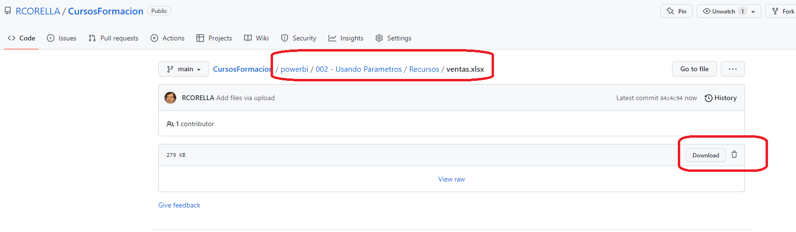
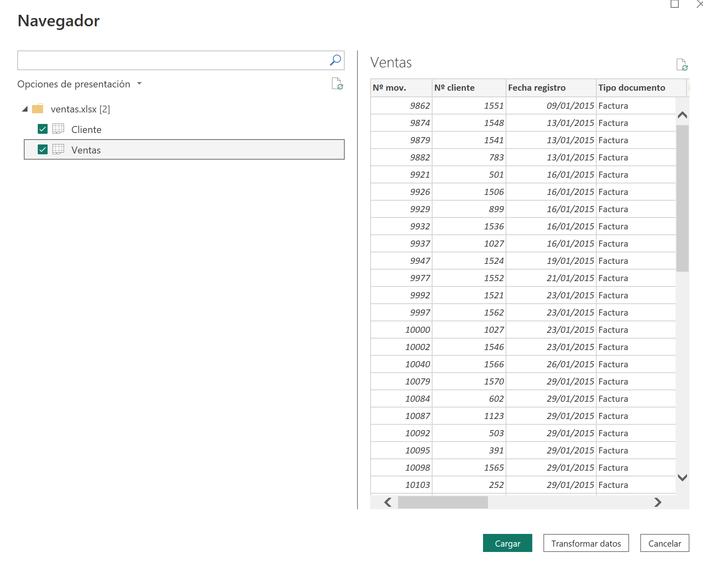
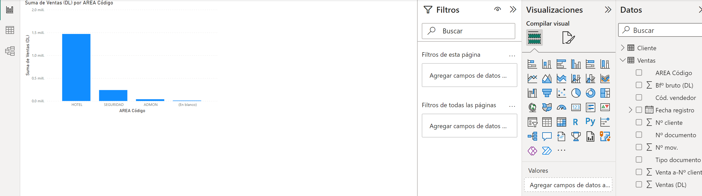
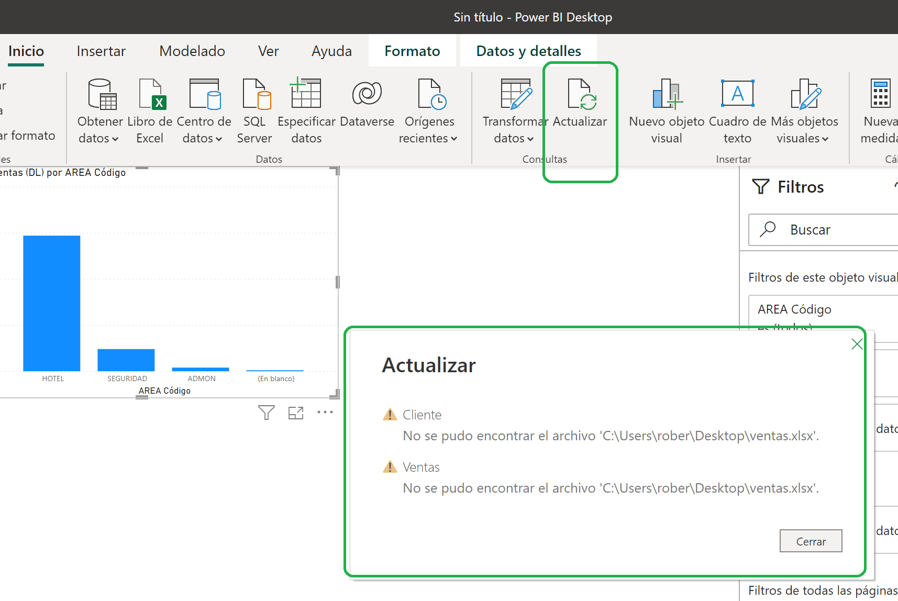
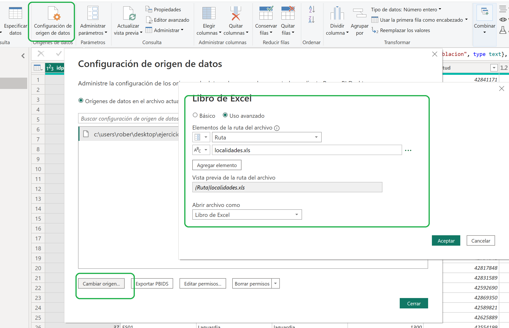



**Parámetros**

Necesitamos tener un parametro con la ruta de nuestros ficheros Excel para en caso de que cambien de ubicación poderlo modificar rápidamente.

**Ejercicio**

1 - Descargarnos el fichero **ventas.xlsx** de la carpeta Recursos

2 - Guardarlo en el escritorio

3 - Abrir Power BI y **cargar** el fichero de excel recien descargado.

4 - Crear un visualizador de "Columnas apiladas" y poner las ventas por Area
	- Eje X: Area Código
	- Eje Y: Suma Ventas (DL)
	
	

5 - Guardar el fichero PBIX como "ventasHotel.pbix" en una nueva carpeta llamada "c:\misSoluciones"

6 - Crear una carpeta en c:\ llamada recursos y mover (no copiar) allí el fichero **ventas.xlsx**

7 - Desde Power BI Desktop, menú Inicio acción "Actualizar", nos permite obtener los cambios en el fichero de origen, pero:

	

** Utilizamos los parámetros para definir el origen de los datos  **

**Desde Power Query Editor**

1 - Abrir en el menú "Inicio" Parámetros / Administrar Parámetros

2 – Crear nuevo parámetro "Ruta", donde introduciremos el "Valor actual" como "c:\recursos\"

	En el panel de consultas, nos aparecerá el nuevo parámetro creado.

3 - Para usar el nuevo parámetro, abriremos "Configuración del origen de los datos"

4 - Cambiar origen

5 - Poner el uso avanzado

6 - Seleccionar el parámetro recien creado en la primera fila (si es necesario pinchar a bajar el nombre del fichero que teníamos)

7 - Añadir el nombre del fichero en un segundo elemento.

8 - Cerrar y aplicar Power Query Editor

9 - Actualizar datos.

10 - Guardar el fichero "ventasHotel.pbix"

09 de Marzo 2023        @rccorella
