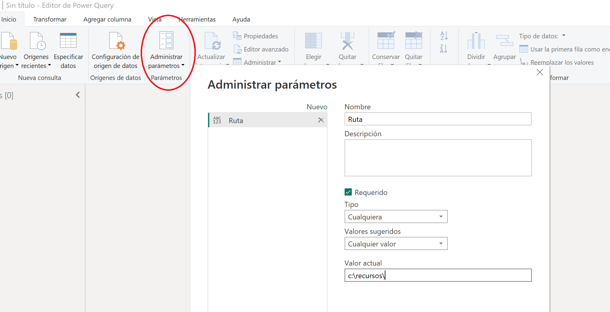
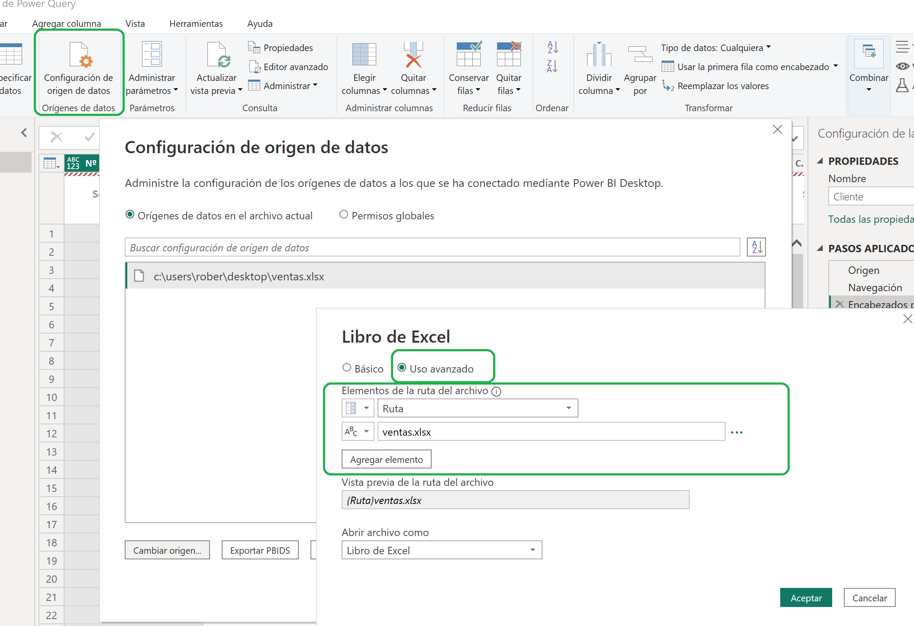

**Parámetros**

Necesitamos tener un parametro con la ruta de nuestros ficheros Excel para en caso de que cambien de ubicación poderlo modificar rápidamente.

**Ejercicio**

1 - Descargarnos el fichero **ventas.xlsx** de la carpeta Recursos

2 - Guardarlo en el escritorio

3 - Abrir Power BI y cargar el fichero de excel recien descargado.

4 - Guardar el fichero 

**Desde Power Query Editor**

1 - Abrir Parámetros / Administrar Parámetros

2 – Crear nuevo parámetro

3 - Para usar el nuevo parámetro, abriremos "Configuración del origen de los datos"

4 - Cambiar origen

5 - Poner el uso avanzado

6 - Seleccionar el parámetro recien creado

7 - Añadir el nombre del fichero en un segundo elemento.

09 de Marzo 2023        @rccorella
