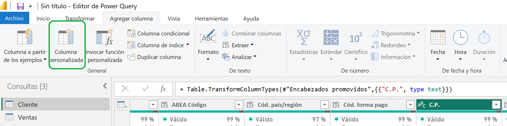
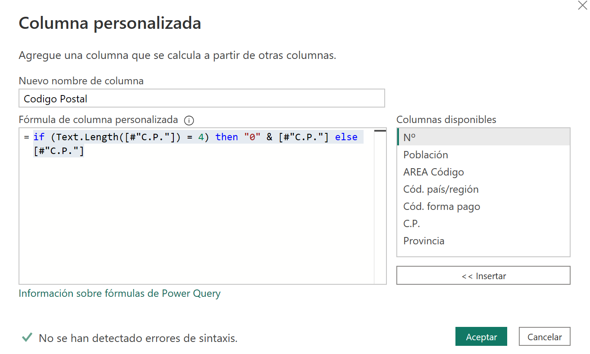
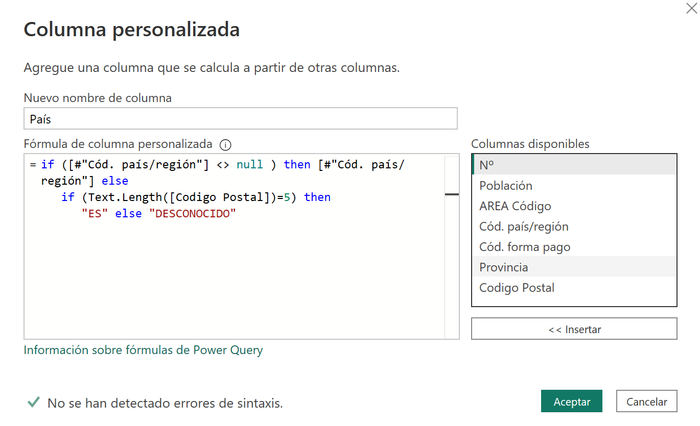
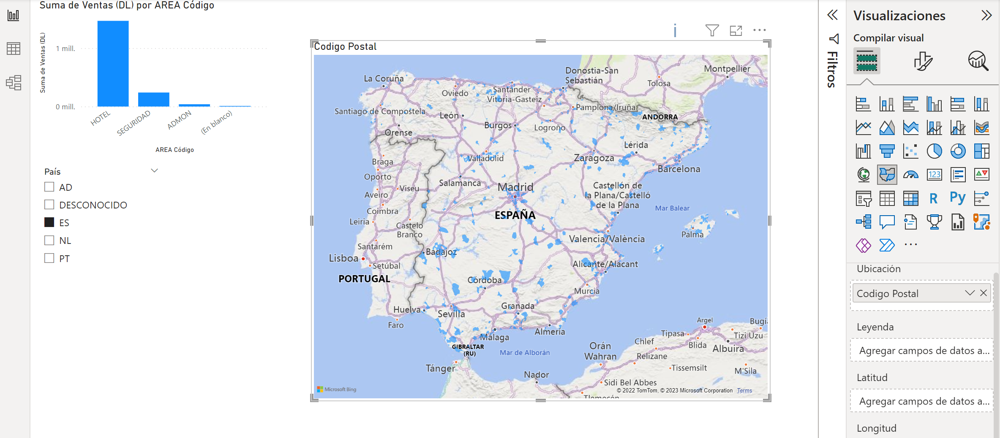



**Limpieza y transformación**

Basándonos en el ejercicio 002, vamos a realizar varias transformaciones.

https://github.com/RCORELLA/CursosFormacion/blob/main/powerbi/002%20-%20Usando%20Parametros/parametros.md

En este ejemplo vamos a limpiar configurar correctamente los códigos postales de España, y vamos a poner el páis en caso de que esté vacio.

**Desde Power Query Editor**

1 - En la consulta "Cliente", cambiamos el tipo de la columna C.P. a Texto (ABC)

2 - Desde el menú, agregar columna, añadiremos una columna personalizada

3 – En el "Nuevo nombre de la columna" le pondremos "Codigo Postal"

4 - En la fórmula le pondremos:

	if (Text.Length([#"C.P."]) = 4) then "0" & [#"C.P."] else [#"C.P."]

5 - Se nos creará una columna nueva con los códigos postales de 5 dígitos

6 - Eliminar la columna "C.P."

7 - Cambiar el tipo de dato de Codigo Postal a texto "ABC"

8 - Crear una columna personalizada para eliminar los nulos de la columna País con la siguiente formula

if ([#"Cód. país/región"] <> null ) then [#"Cód. país/región"] else 
   if (Text.Length([Codigo Postal])=5) then 
      "ES" else "DESCONOCIDO"
	  
	  

9 - Quitar la columna "Cód. Pais / region"

10 - Cerrar y Aplicar Power Query

11 - Añadir en Power BI Desktop un Segmentador con el Pais

12 - Añadir un mapa Coroplético con los códigos postales de los clientes

	

09 de Marzo 2023        @rccorella
