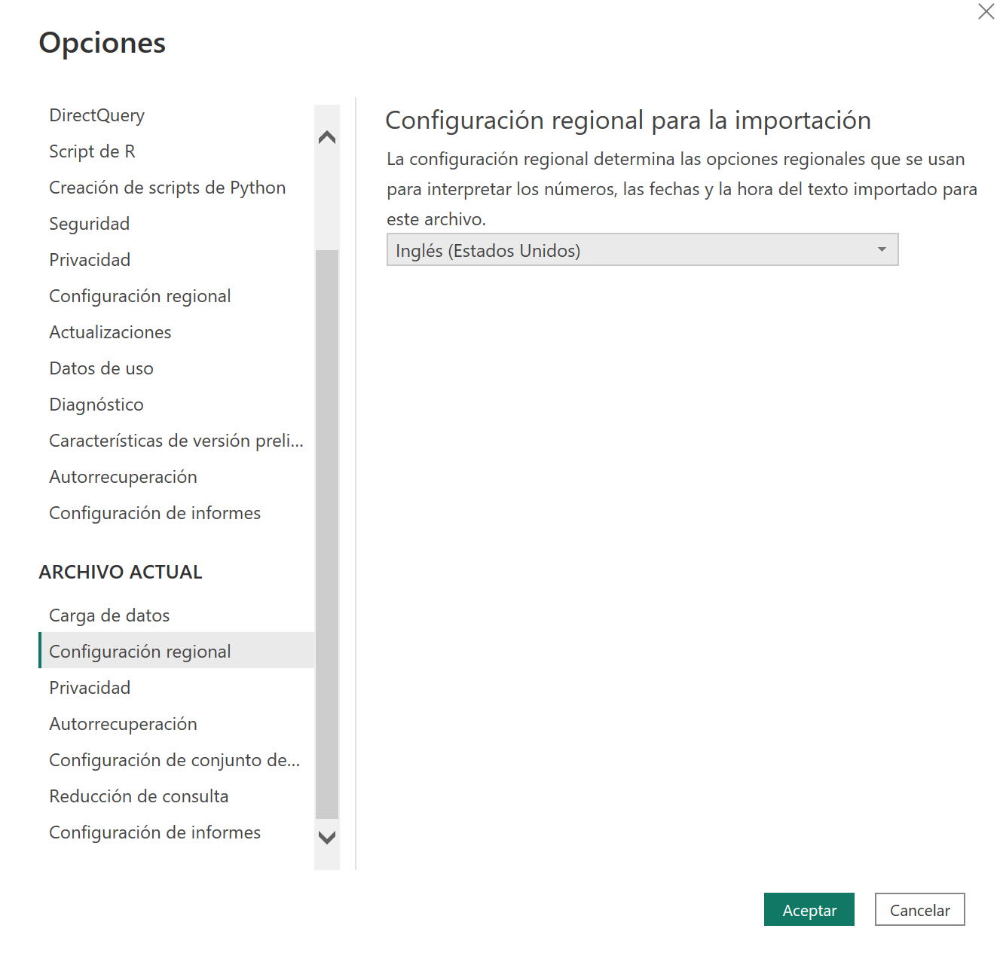
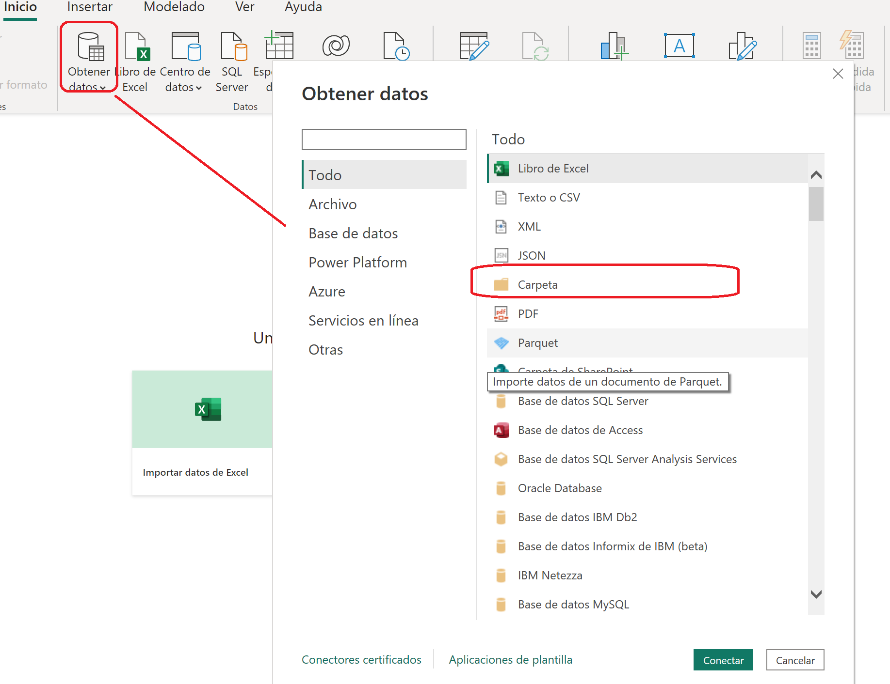
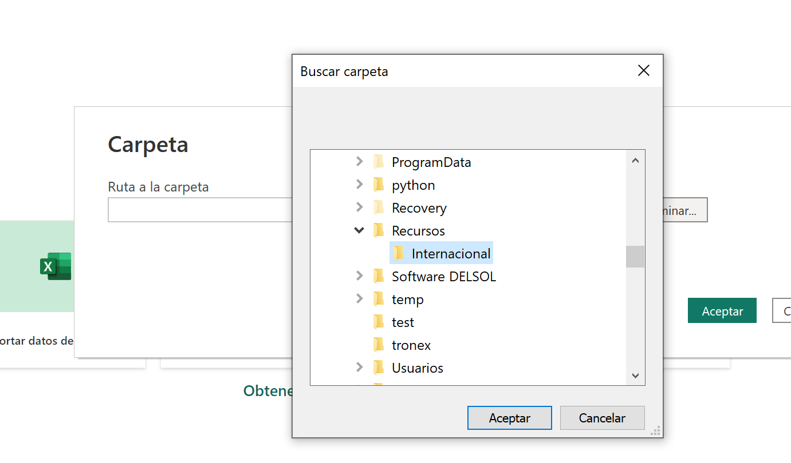
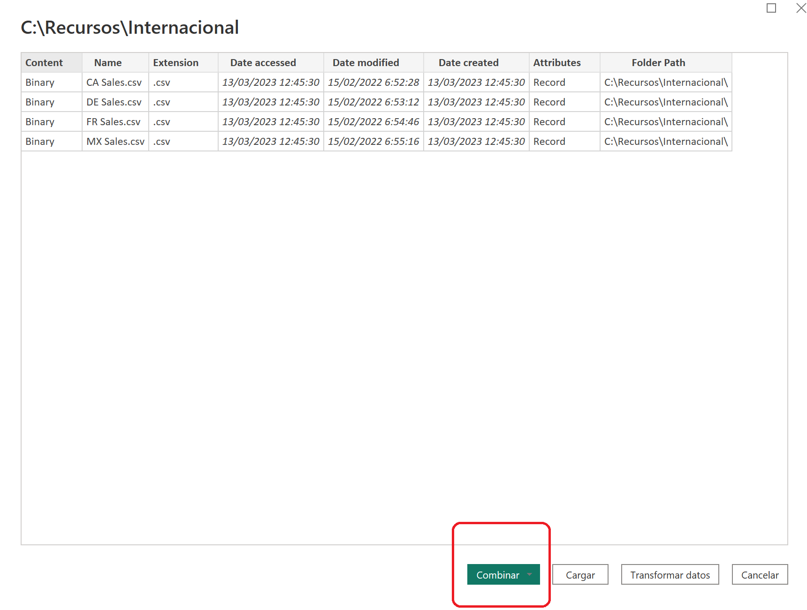
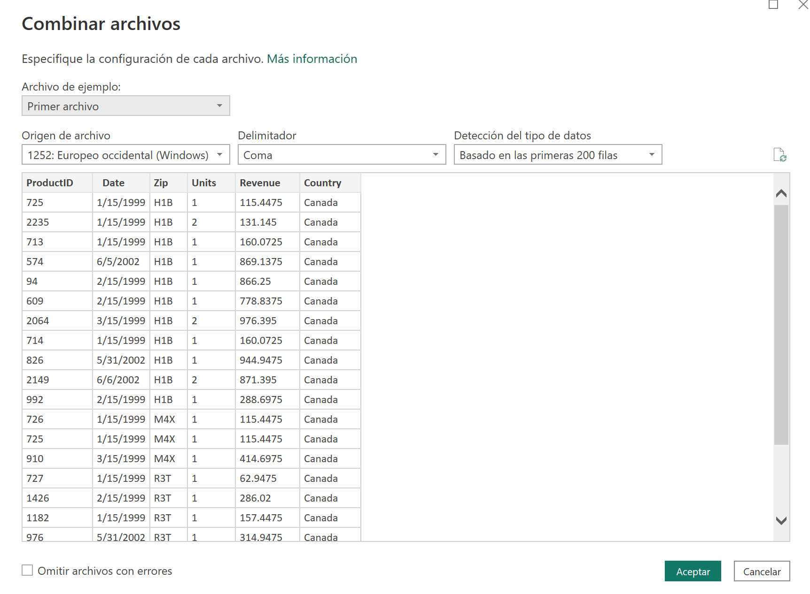
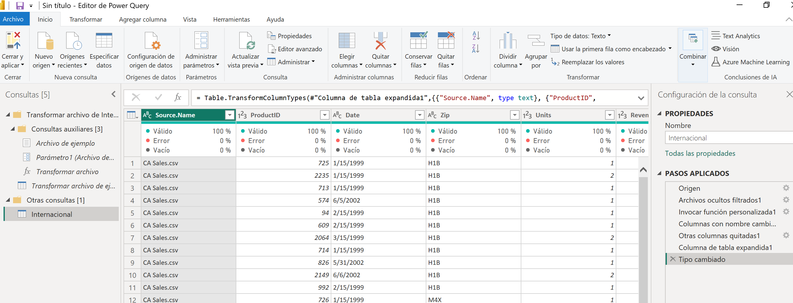
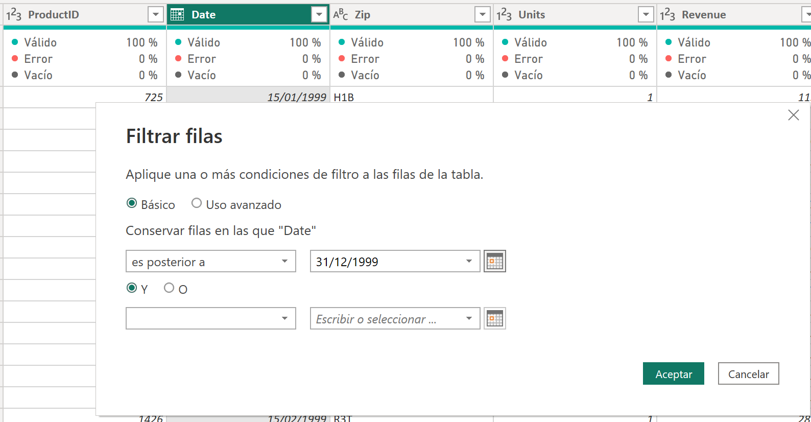



**Obtener datos de carpetas**

El ejercicio trata de importar en lugar de diferentes ficheros csv, importar directamente una carpeta.

Procederemos a importar los ficheros que tengamos en un Power BI Desktop.

**Preparación**

Descargar la carpeta **internacional**, que se encuentra en "Recursos".  Guardarla en c:\Recursos_XX\, donde XX seran vuestras iniciales.

Para descargar la carpeta, pincha este enlace:

[Link Descarga](https://minhaskamal.github.io/DownGit/#/home?url=https://github.com/RCORELLA/CursosFormacion/tree/main/powerbi/004%20-%20Importaci%C3%B3n%20Carpetas/Recursos/Internacional)

Cuando abrimos Power BI, por defecto nos va a poner la configuración regional española.  Los datos están con formatos de fecha en inglés Americano, por lo que sería interesante, cambiar la configuración desde Fichero / Opciones / Configuración Regional "Inglés (Estados Unidos)"

Pulsar, aplicar cambios.

**Desde Power BI Desktop**

1 - Desde obtener datos del menú de inicio de Power BI desktop, seleccionar **carpeta**

2 - Seleccionamos la carpeta localizada en c:\recursos_XX\internacional y pulsamos Aceptar

3 – Nos aparece una pantalla donde podremos ver los diferentes ficheros encontrados.  Pulsaremos Combinar y luego "Combinar y transformar datos".  En este caso, combinar significa que uniremos todos los ficheros en una tabla.  No tiene que ver con "Combinar" consultas.

4 - Esto nos abrirá el asistente de CSVs, indicando el formato que va a importar.  Podemos ver la configuración de cada fichero individualmente aunque en nuestro caso todos ellos tienen la misma estructura.  Pulsaremos "Aceptar"

	

5 - Nos aparecerá una nueva consulta con los datos importados

6 - Renombramos la consulta como "Ventas internacionales"

7 - Eliminar la columna Source.Name, ya que corresponde al nombre del fichero que ya no nos interesa.

8 - Cambiar el tipo de dato de la columna Date a tipo Fecha

9 - Filtrar la consulta de forma que solamente muestre las ventas desde 01/01/2000 mediante la opción filtrar.

10 - Cerrar y Aplicar

11 - Guardar el fichero como "Ventas Cronus.pbix" en c:\misSoluciones_XX, donde XX serán vuestras iniciales.

13 de Marzo 2023        @rccorella
