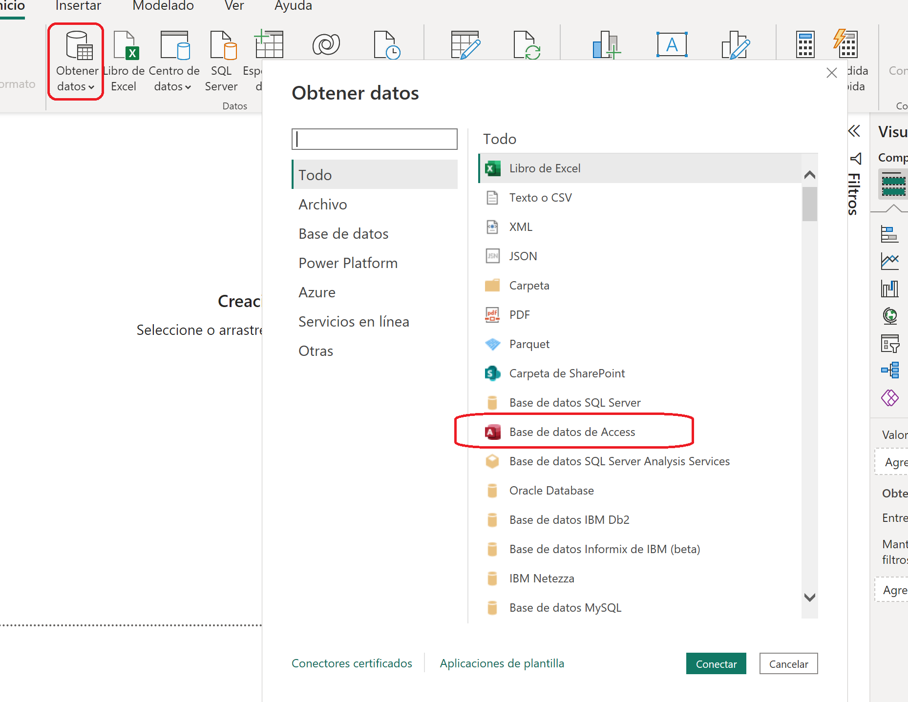
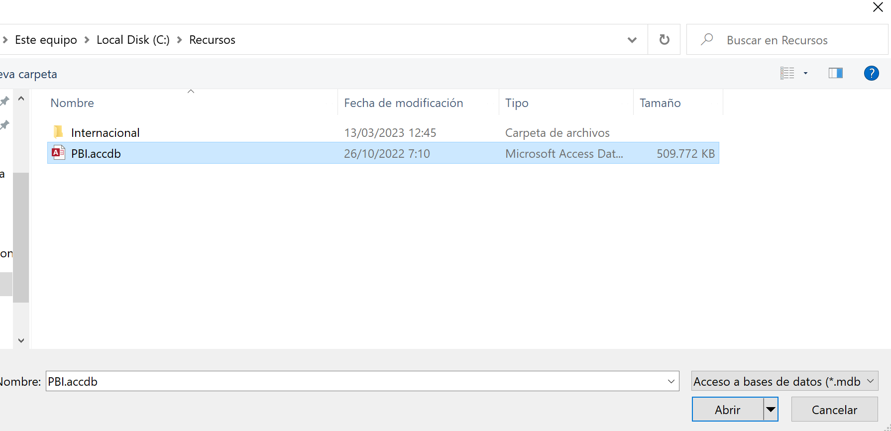
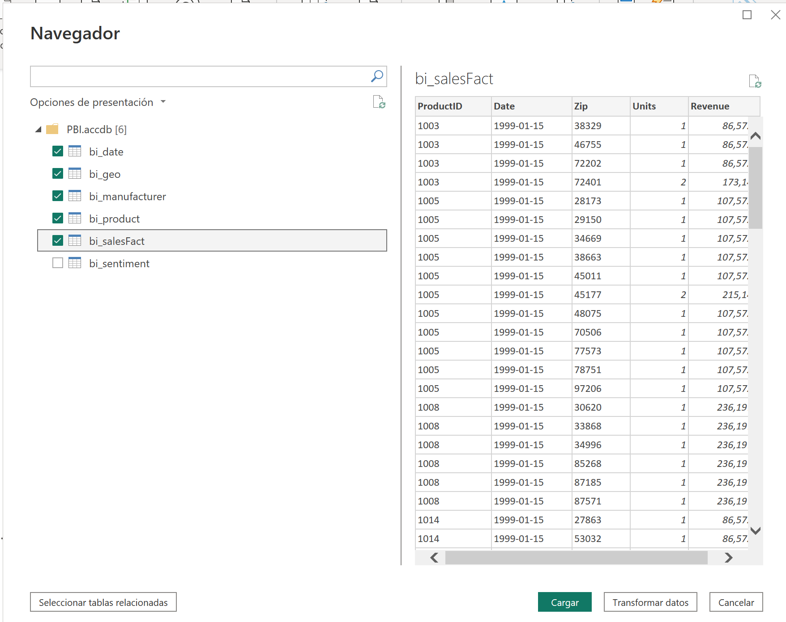



**Obtener datos de Access y Transformación**

El ejercicio trata de obtener datos de Access para importarlos a Power BI Desktop.

Es posible que necesitemos un control para acceder a los ficheros access.

**Preparación**

Descargar la base de datos access de:

https://pruebasformacion.blob.core.windows.net/power/powerbi/PBI.rar

Descomprimirla y guardarla en c:\Recursos\.

Cuando abrimos Power BI, por defecto nos va a poner la configuración regional española.  Los datos están con formatos de fecha en inglés Americano, por lo que sería interesante, cambiar la configuración desde Fichero / Opciones / Configuración Regional "Inglés (Estados Unidos)"

Pulsar, aplicar cambios.

**Desde Power BI Desktop**

0 - Abrir el fichero creado en el ejercicio 004.

https://github.com/RCORELLA/CursosFormacion/blob/main/powerbi/004%20-%20Importaci%C3%B3n%20Carpetas/carpetas.md

1 - Desde obtener datos del menú de inicio de Power BI desktop, seleccionar **Access**

2 - Seleccionamos la carpeta localizada en c:\recursos\internacional y pulsamos Aceptar

3 – Nos aparece un navegador, donde podemos encontrar todas las tablas de la base de datos

4 - Seleccionamos las tablas indicadas y pulsamos "Transformar datos", lo que nos abrirá el Power Query
	
5 - Filtrar bi_salesFact para que nos muestre las fechas posteriores al 31/12/1999

6 - Renombramos las consultas como:
	
	- bi_date : Fecha
	- bi_geo : Ubicaciones
	- bi_manufacturer: Fabricantes
	- bi_product : Productos
	- bi_salesFact : Ventas

10 - Cerrar y Aplicar (Puede tardar unos minutos en aplicarse)

11 - Guardar el fichero como "Ventas Cronus.pbix"

13 de Marzo 2023        @rccorella
