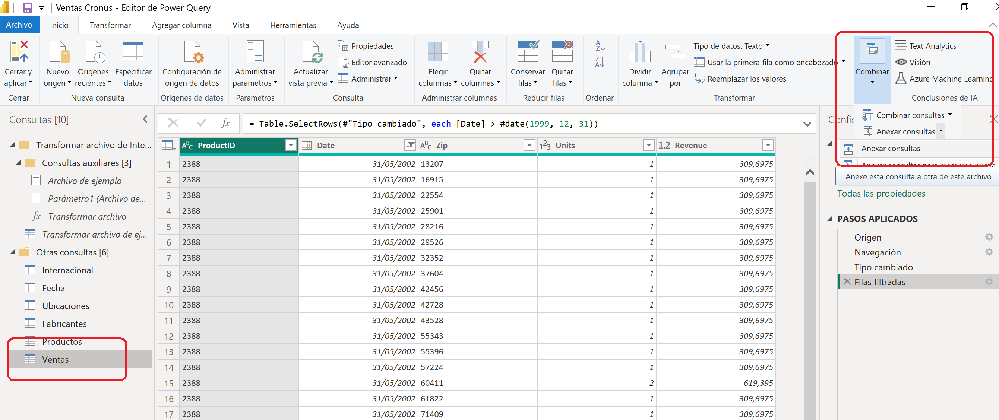
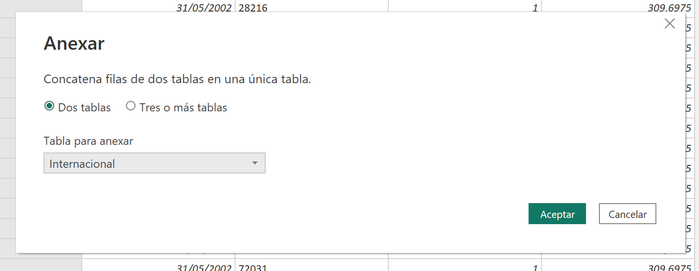
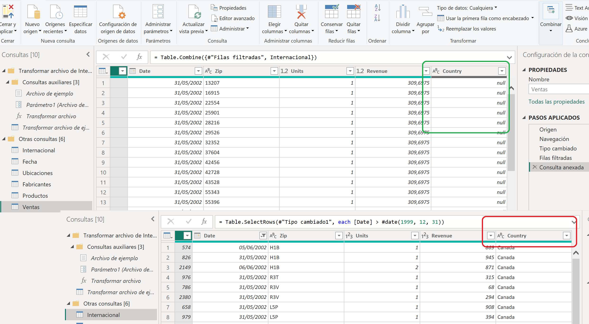
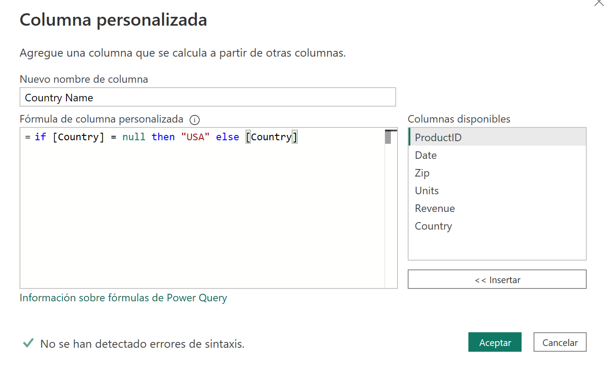



**Anexando Tablas**

Continuación del ejercicio anterior, donde añadiremos una tabla a otra.

**Preparación**

Debemos tener realizados los ejercicios 004 y 005 para poder realizar esta tarea.

**Desde Power BI Desktop**

0 - Abrir el fichero creado en el ejercicio 004 y modificado en el 005: "Ventas Cronus.pbix" 

	Comprobamos que el número de registros de la tabla "Ventas" sería de: 6.022.217

1 - Ir a Power Query desde el botón transformar datos

2 - Nos situamos en la consulta "Ventas"

3 – Agregamos la tabla de "Ventas Internacionales" a la consulta de las ventas USA.  Para ello usaremos "Anexar"

4 - Seleccionamos la tabla "Ventas Internacionales" como la **tabla a anexar**:

 
	
5 - Observamos que las tabla original "Ventas" no disponía del campo "Country", por lo que aparece como "null", ya que las "Ventas internacionales" si lo tenían:

6 - En la consulta "Ventas" agregaremos una columna condicional llamada "Country Name" que tome el nombre del país de "Country" y en caso de que sea "null" la rellene con "USA".

if [Country] = null then "USA" else [Country]

7 - Eliminamos la columna Country

8 - Cerrar y Aplicar (Puede tardar unos minutos en aplicarse)

9 - Guardar el fichero como "Ventas Cronus.pbix" en "c:\MisSoluciones_xx\" 

14 de Marzo 2023        @rccorella
