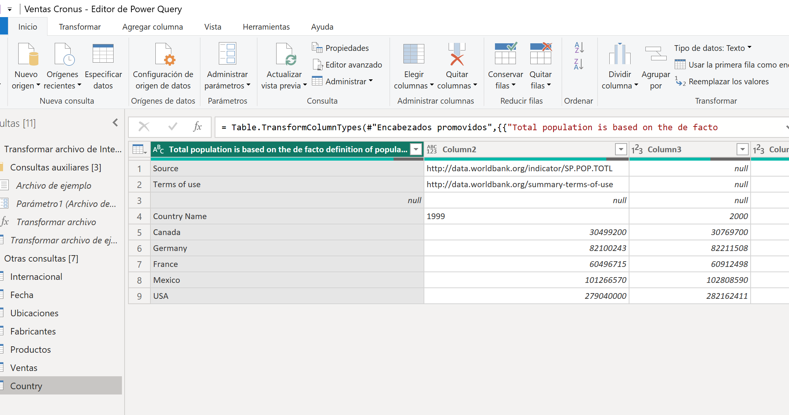
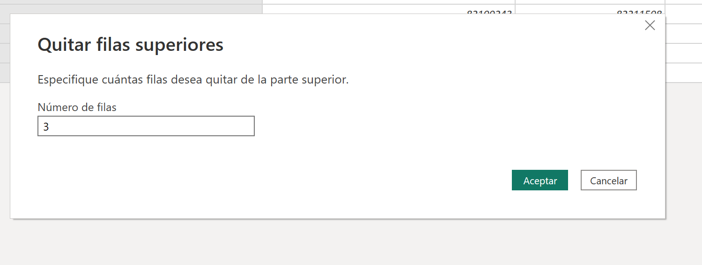
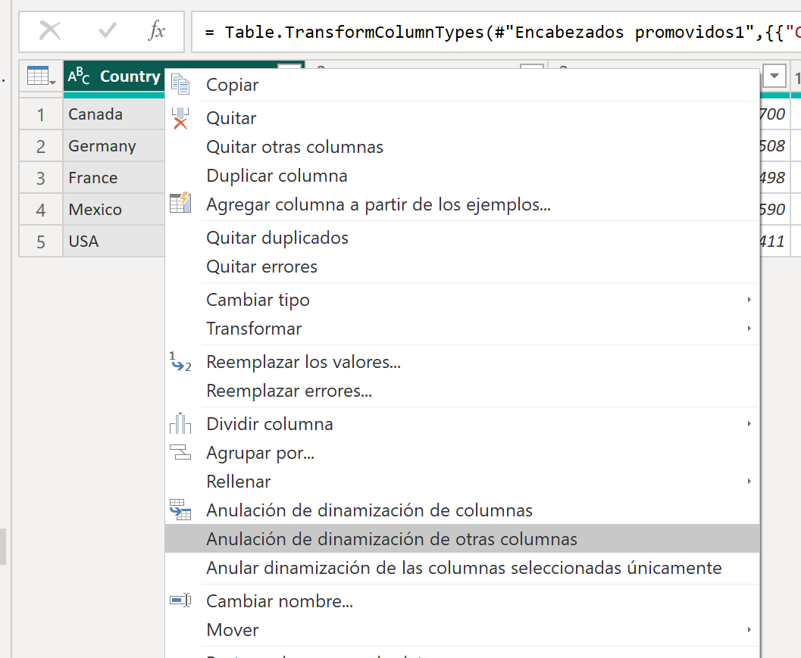



**Manipulando Excel dinámicas**

En este ejercicio, añadiremos y desdinamizaremos una tabla dinámica de excel.

**Preparación**

Debemos tener realizados los ejercicios 004, 005 y 006 para poder realizar esta tarea.

Descargar el fichero Country Population by Year.xlsx que se encuentra en la carpeta recursos de este ejercicio y guardarlo en c:\recursos_xx\.  Este archivo contiene la población mundial.

**Desde Power BI Desktop**

0 - Abrir el fichero que tendremos en nuestra carpeta "c:\misSoluciones_XX\Ventas Cronus.pbix" 

1 - Cargar la tabla "Country Population by Year.xlsx" que nos hemos guardado en "c:\recursos_xx\"

2 - Pinchar en transformar datos

3 – Cambiar el nombre de la consulta a "Poblacion"

4 - Eliminamos las **3 primeras filas**  mediante la opción "Quitar filas superiores"

 
	
5 - Promover a cabeceras la primera línea, mediante "Usar la primera línea como encabezado"

6 - Convertir las columnas de año en filas.  Para ello, seleccionaremos la columna "Country" y ejecutaremos la instrucción "Anular dinamización de otras columnas"

7 - Cambiamos el nombre de Atributo por **Year** y Valor por **Population**

8 - Filtrar para que eliminar los valores de 1999

9 - Cambiar el tipo de la columna Year a Número entero

Resultados de la consulta "Poblacion"
Filas: 75 

10 - Cerrar y Aplicar (Puede tardar unos minutos en aplicarse)

11 - Guardar el fichero como "Ventas Cronus.pbix" en "c:\MisSoluciones_xx\" 

14 de Marzo 2023        @rccorella
