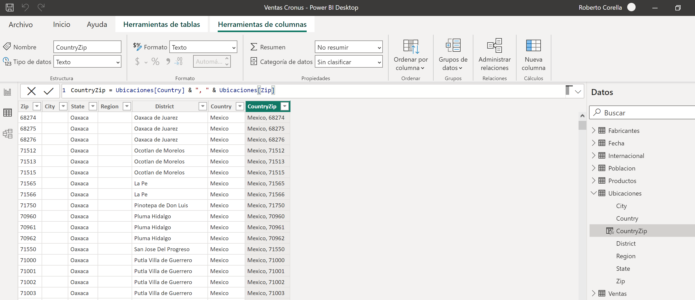
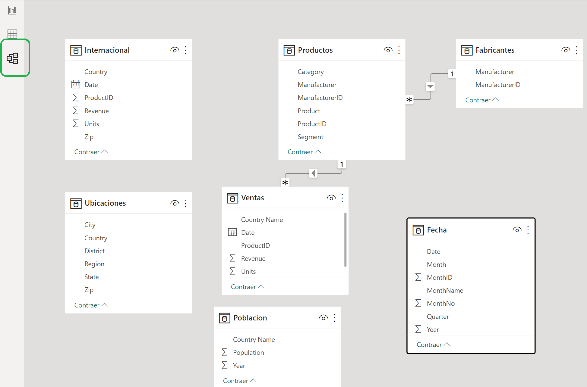
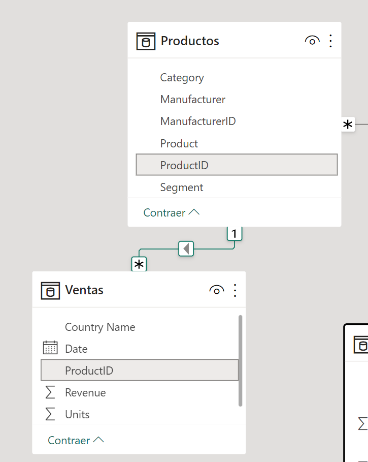
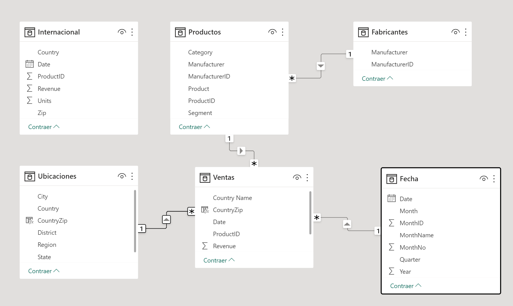



**Relaciones entre tablas**

En este ejercicio, comenzamos a relacionar nuestras tablas para realizar nuestro modelo.

**Preparación**

Debemos tener realizado el ejercicio 007 para poder realizar esta tarea.

La nomenclatura usada para indicar las tablas y columnas en las relaciones será ** Tabla | Columna**.

**Desde Power BI Desktop**

0 - Abrir el fichero que tendremos en nuestra carpeta "c:\misSoluciones_XX\Ventas Cronus.pbix" 

1 - Nos vamos a la vista de datos y seleccionamos la tabla "Ubicaciones".  Desde allí crearemos una nueva columna "CountryZip" combinando Country y Zip, separados por una coma y un espacio.

2 - Seleccionamos la tabla "Ventas" y creamos la misma columna "CountryZip", combinando "Country name" y Zip, separados por una coma y un espacio.

3 - Abrir la vista de modelo y coloque las tablas en esquema de estrella, poniendo la tabla "Ventas" en el centro.

4 – Power BI, habrá detectado las siguientes relaciones:

	Ventas | ProductID  con Productos | ProductID
	
	Productos | ManufacturerID con Fabricantes | ManufacturerID
	
	

5 - Crearemos las relaciones:

	Fechas | Date y Ventas | Date
	
	Ventas | CountryZip y Ubicaciones | CountryZip
	
	

 
	

10 - Cerrar y Aplicar (Puede tardar unos minutos en aplicarse)

11 - Guardar el fichero como "Ventas Cronus.pbix" en "c:\MisSoluciones_xx\" 

14 de Marzo 2023        @rccorella
