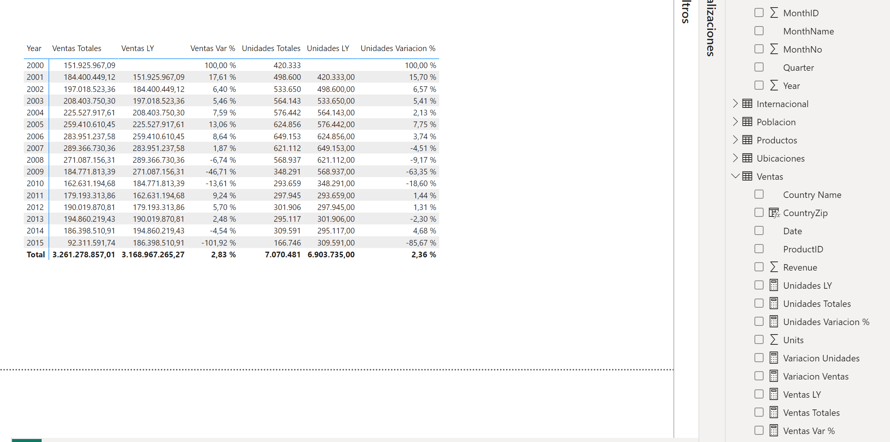



**Uso de DAX**

En este ejercicio usaremos DAX para obtener datos comparativos entre años.

**Preparación**

Debemos tener realizado el ejercicio 008 para poder realizar esta tarea.

**Escenario**

Desea saber la cantidad total de ventas (ingresos) que tiene la empresa CRONUS y compararla con la cifra del mismo período del año pasado.

**Desde Power BI Desktop**

Abrir el fichero que tendremos en nuestra carpeta "c:\misSoluciones_XX\Ventas Cronus.pbix" 

Desde la tabla "Ventas", con el botón derecho, podemos seleccionar "Nueva Medida" para ir creando las siguientes medidas:

1 - Medida "Ventas Totales" que corresponderán al total de las ventas.  El formato debe ser como moneda.

	

2 - Medida "Ventas LY", que calcule las ventas del año anterior.  El formato sería moneda.

	Tip: sería interesante usar Calculate y SAMEPERIODLASTYEAR

	
3 - Medida "Variacion Ventas".  Calcula la variación entre las ventas de un periodo y las ventas del periodo del año anterior.  El formato sería moneda.

	

4 – Medida "Ventas Var %".  Calcula la variación de ventas entre un periodo y el año anterior en porcentaje.  El formato debe ser de porcentaje.

	Tip: Puede ser interesante usar la función DIVIDE

		
5 - Medida "Unidades Totales", que indicará el total de unidades vendidas.

	Tip: Revisar la función SUM

	
6 - Medida "Unidades LY", que indicará las unidades vendidas el año anterior.  

	Tip: sería interesante usar Calculate y SAMEPERIODLASTYEAR
	
		

7 - Medida "Variacion Unidades", que nos indicará la diferencia entre las unidades vendidas este año y las del año anterior.
 
		
8 - Medida "Unidades Variacion %", nos indicará el porcentaje de la diferencia de las unidades vendidas.

	
9 - Mostrar un visualizador tabla con los años y las medidas que acabamos de calcular

10 - Cerrar y Aplicar (Puede tardar unos minutos en aplicarse)

11 - Guardar el fichero como "Ventas Cronus.pbix" en "c:\MisSoluciones_xx\" 

14 de Marzo 2023        @rccorella
