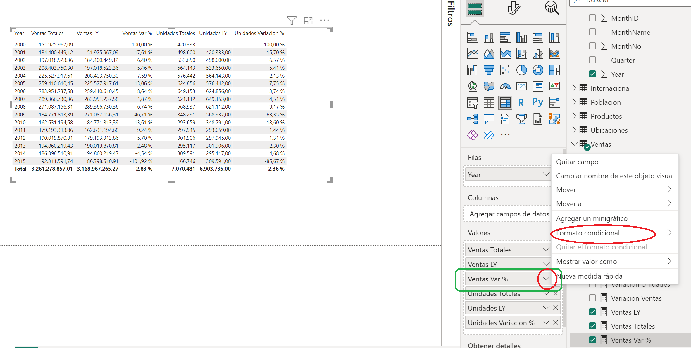
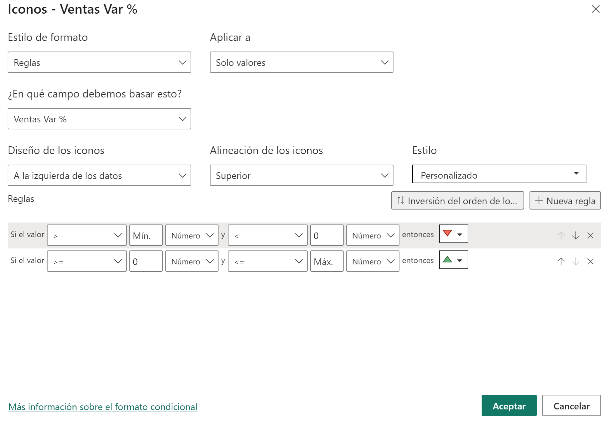
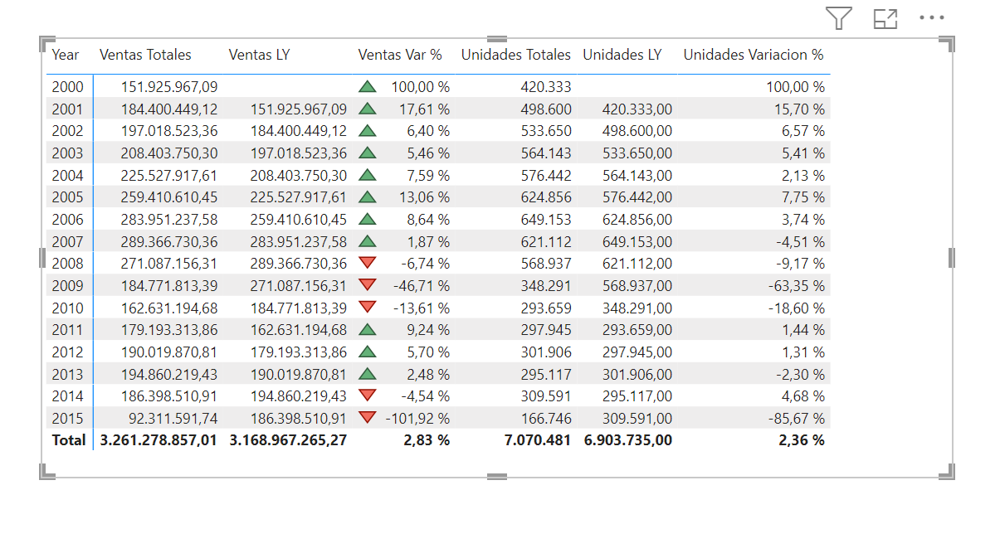



**Indicadores**

Basándonos en el ejercicio anterior 009, pondremos unos indicadores para saber si ha subido las ventas o han bajado con respecto al año anterior.

**Preparación**

Debemos tener realizado el ejercicio 009 para poder realizar esta tarea.

**Escenario**

Pondremos unos indicadores en función de los formatos condicionales.

**Desde Power BI Desktop**

Abrir el fichero que tendremos en nuestra carpeta "c:\misSoluciones_XX\Ventas Cronus.pbix" 

1 - Nos colocamos en la pestaña de report y seleccionamos el visualizador con las ventas por años.

2 - En el panel de visualizaciones, desplegamos la flecha hacia abajo que encontramos en la sección "Valores" y la medida "Ventas Var %".  Nos despliega un menu donde encontraremos "Formato Condicional"

	
3 - Desplegamos y nos muestra la opción "iconos"

4 – En Estilo, seleccionamos los triángulos rojo, amarillo y verde.
		
5 - Quitamos la regla del amarillo (solamente nos interesa si hay crecimiento o decrecimiento), pinchando en el aspa que nos encontramos a la derecha.
	
6 - En la sección Reglas

		- quitar el valor de la segunda casilla.  Se quedará en "Min" y en la tercera seleccionar "Número"
		
		- En la quinta casilla poner 0 y en la sexta "Número"
		
		- En la segunda fila en la segunda casilla poner 0 y en la tercerá "Número"
		
		- En la quinta casilla, eliminar el valor (nos pondrá "Máx") y en la sexta casilla poner "Número"
		
		

		
		

7 - Al aceptar nos pondrá los iconos.

8 - Guardar el fichero como "Ventas Cronus.pbix" en "c:\MisSoluciones_xx\" 

15 de Marzo 2023        @rccorella
