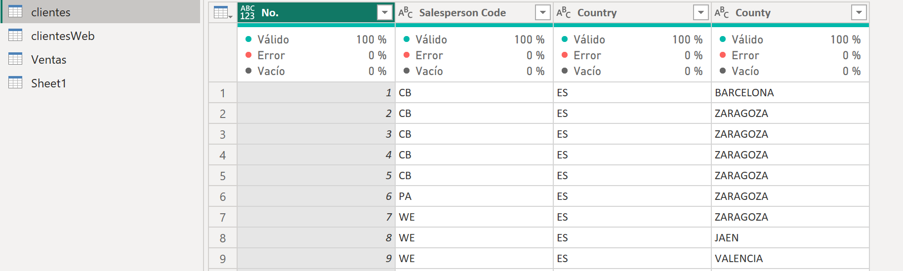
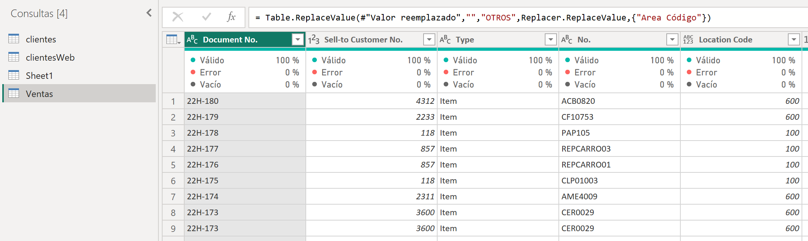
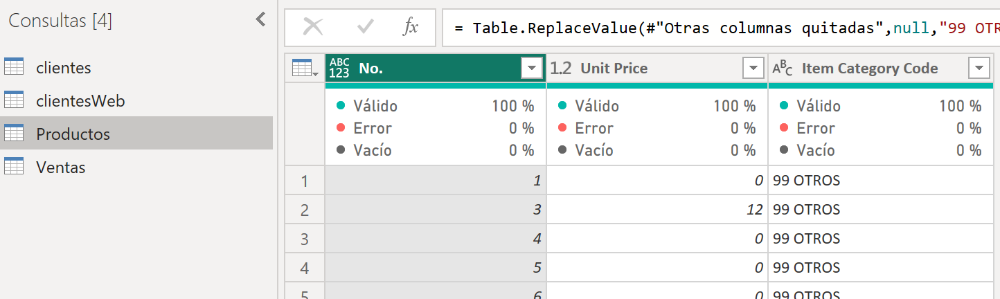
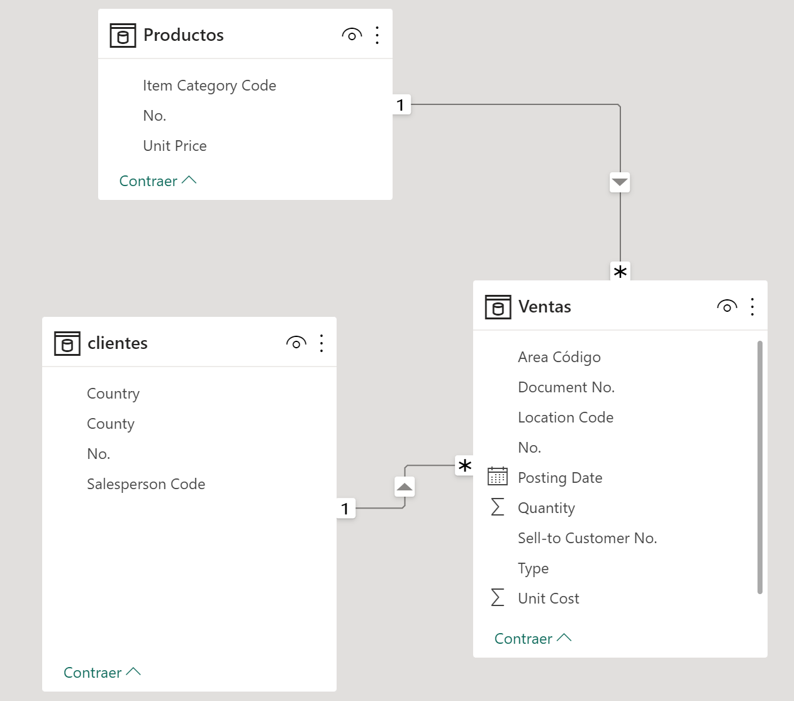
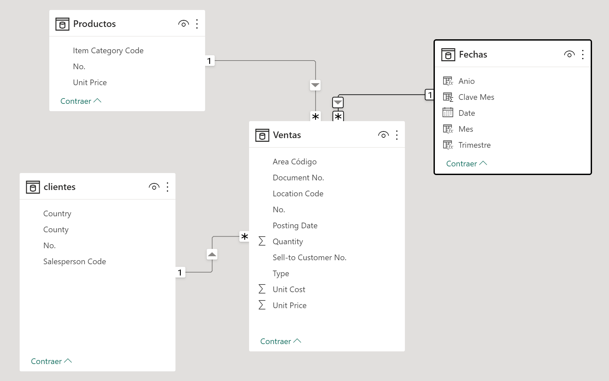
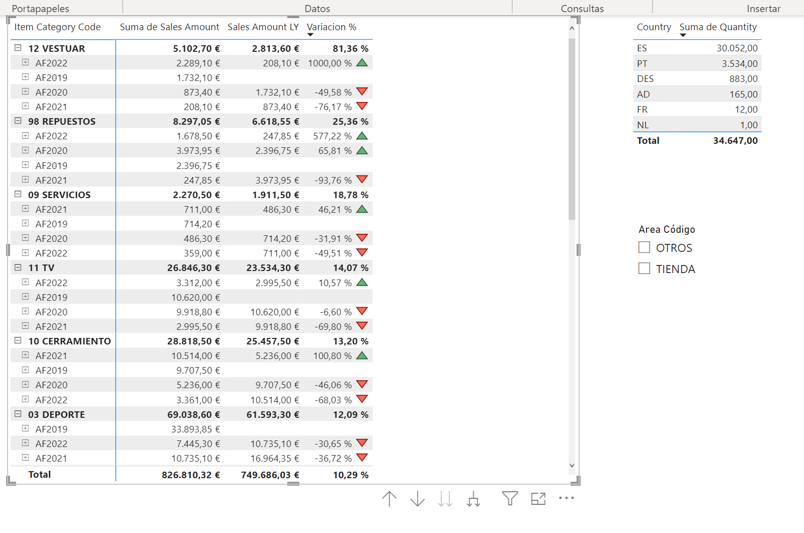



**Revision de origenes de datos, transformación y modelado**

En este ejercicio puntuable, procederemos a realizar un escenario completo, basándonos en las herramientas vistas.

**Escenario**

La empresa Contoso de venta al por menor desea analizar sus ventas para el año pasado y compararlas con las ventas del año anterior para identificar la variación, así como las unidades vendidas en cada páis.

**Ejercicio 1: Obtener datos de diversas fuentes** (2 puntos)

Descarga el archivo de "ventas Contoso.xlsx" correspondiente a las ventas de los últimos años en formato Excel y guárdalo en tu ordenador en la carpeta c:\recursos_xx, donde XX corresponderá a tus iniciales.

Importa los datos de clientes del archivo de texto:  "clientes_onsite.csv".

Importa los datos de clientes web del archivo de texto:  "clientes_web.csv".

Importa los productos del archivo de excel productos.xlsx.

Usar un parámetro ruta, para indicar el directorio donde están almacenados los origenes de los datos.

**Ejercicio 2: Dar formato a diversas queries** (3 puntos)

2.1 Preparar consultas

2.1.1 Crea una única tabla de clientes, que unifique los clientes onsite y los clientes web.  (1 punto)

    - Deberemos de tener las siguientes columnas
	
		* No.
		* Salesperson Code
		* Country
		* County

	- A los clientes web, le pondremos como "Salesperson Code" = WEB  (null -> WEB)
	- A los clientes con "Country" vacio, le pondremos "DES"
	- A los clientes con "County" vacio, le pondremos "DESCONOCIDO"
	- El campo No. debe de ser de tipo Texto.
	- Eliminar No. de clientes duplicados
	
	Asegurarnos de que la calidad de las columnas están todas "Válidas"
	
	
	
2.1.2 Ventas (1 punto)

	- El campo No. debe de ser de tipo Texto
	- Eliminar las columnas no necesarias.  Dejar solo:
		* Document No.
		* Sell-to Customer No.
		* Type
		* No.
		* Location Code
		* Quantity
		* Area Código
		* Unit Cost
		* Posting Date
		
	- El campo "Sell-to Customer No." debe de ser de tipo texto.	
	- Solamente vamos a trabajar la información de ventas de 2022, 2021, 2020 y 2019
	- Solamente vamos a trabajar las ventas de Type = Item
	- Solamente vamos a trabajar las ventas que tienen "Location Code"
	- Los valores que no tengan "Area Código" o sea null, poner como "OTROS"
	
	
		
2.1.3 Productos (0,5 puntos)

	- Renombrar la consulta Sheet1 por Productos
	- Dejar las columnas
	    * No.
		* Unit Price
		* Item Category Code
		
	- En caso de que "Item Category Code" sea null poner "99 OTROS"
	
	
	
2.1.4 Ventas con importe de venta (0,5 puntos)

	- Añadir a la consulta "Ventas" el campo "Unit Price" 
		Tip: Podemos usar Combinar tablas con Productos

	
Comprobación de Registros:

Productos: 1323
Clientes: 4278
Ventas: 2090

**Ejercicio 3: Crear un modelado de datos en estrella** (0,5 punto)

Crear las siguientes relaciones

	Producto | No.  con Ventas | No.
	clientes | No.  con Ventas | Sell-to Customer No.
	
Ocultar la tabla "Clientes Web"

**Ejercicio 4: Crear una tabla de fechas en DAX** (1 punto)

Crea una nueva tabla "Fechas" en DAX
Agrega columnas a la tabla de fechas para incluir información adicional

   - Mes (en letras)
   - Trimestre (T1, T2,...)
   - Anio: Añadimos el prefijo AF de año fiscal (AF2019, AF2022,..) 

Recordad que los meses tendrán que estar ordenados por nº de mes y no alfanuméricamente.

**Ejercicio 5: Crear las relaciones correspondientes a fechas** (0,5 puntos)

Establece una relación entre la tabla de hechos de ventas y la tabla de dimensión de fechas

**Ejercicio 6: Utilizar las fórmulas de DAX necesarias para Añadir Medidas** (1,5 puntos)

En la tabla Ventas, incluye una columna "Sales Amount" que incluirá la columna "Quantity" multiplicado por la columna "Unit price"

Crea una medida en la tabla ventas, utilizando la función "CALCULATE" y "SAMEPERIODLASTYEAR" para calcular las ventas del año anterior ("Sales Amount LY").
Crea una medida en la tabla ventas, en la que tengamos la variación en porcentaje (se valorará usar variables)

**Ejercicio 7: Poner unos visualizadores de tipo matricial y unos segmentadores** (1 punto)

Crea un visualizador de tipo matricial para mostrar las ventas, las ventas del año anterior y la variación en porcentaje, por categoría de producto, año y mes.

Crea un visualizar de tipo tabla, para mostrar las Unidades vendidas ordenadas por pais.

Agrega un segmentador de Area de venta (Area Código) para permitir a los usuarios seleccionar el Area de ventas.

**Ejercicio 8: Poner indicadores** (0,5 puntos)

Añadir indicadores con triángulos verdes o rojos, en función si el variación de ventas ha sido positiva (verde) o negativo (rojo)

**Entregar**

Guardar el fichero como "Ventas Contoso NOMBRE APELLIDO.pbix" en "c:\MisSoluciones_xx\", donde Nombre y Apellidos sean los vuestros.

 

15 de Marzo 2023        @rccorella
