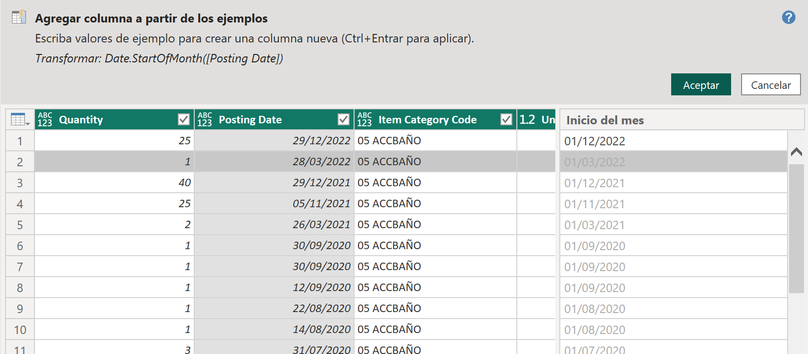
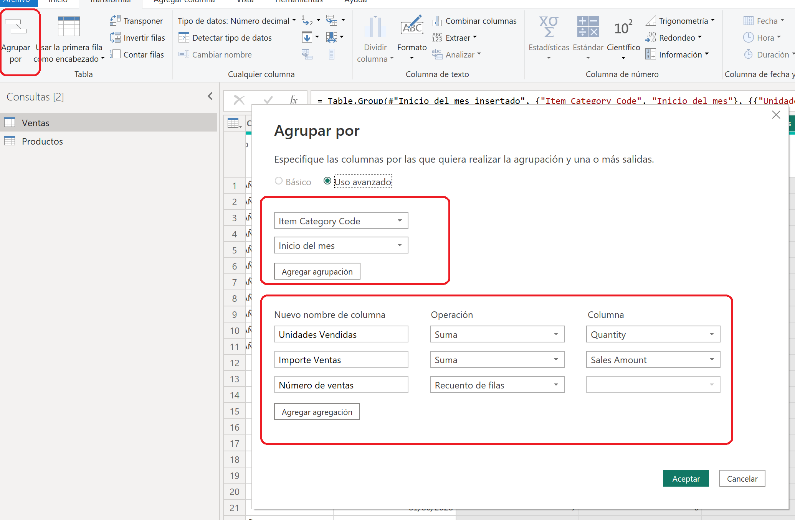
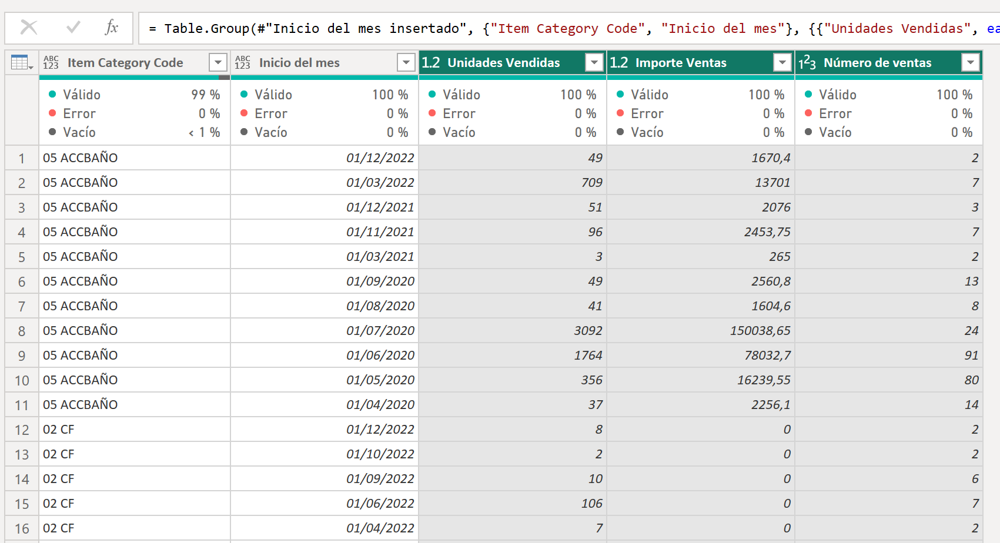



**Agrupación**

Una de las transformaciones que mejoran el rendimiento de los modelos, es utilizar la agrupación para mejorar la granularidad.

Nuestro cliente no quiere ver el detalle de los productos vendidos.  Solamente le interesa por la categoría de producto (Item Category Code)

**Preparación**

Descargar los ficheros "Ventas Contoso.xlsx" y "Productos.xlsx" que se encuentran en Recursos.

Guardarlos en c:\Recursos_xx\  (es posible que ya los tuviesemos de ejercicios anteriores)

**Desde Power BI Desktop**

0 - Abrir un nuevo fichero PBIX

1 - Cargar los dos ficheros de excel e ir a transformar datos.

2 – En la tabla de ventas dejar solamente las columnas
	 Document No
	 Type
	 No.
	 Quantity
	 Posting Date
	 Item Category Code

3 - En la tabla de productos, cambiar el nombre de la consulta por sheet1 -> productos y dejar solamente las columnas

	No. 
	Unit Price
	Item Category Code
	
4 - En la consulta Ventas filtrar para que 
		
		* la columna Type = Item
		* eliminar los productos 3, 6 y 7	

	Es posible que tengamos que eliminar el cambio de tipo que incluye Power BI automatícamente.		
		

5 - En la consulta Productos filtrar por los valores NO null en "Item category Code"

6 - En la consulta Ventas, poner una columna con el importe de venta llamada "sales amount", que se obtenga del "Unit Price" por "Quantity".  Para ello, deberíamos de añadir datos de la consulta producto.

7 - Las ventas cuyo "Unit Price" sea null, ponerlo a cero.

8 - Añadir una columna desde ejemplos, con el primer día del mes, el mes y el año de la venta

	 
9 - Agrupar valores de ventas por 

		Item Category Code 
		mes y año de venta
		
		La agrupación será de
			
			Unidades vendidas
			Importe de ventas
			Número de líneas de venta
		

	
El resultado sería:
	

	

10 - Cerrar y Aplicar (Puede tardar unos minutos en aplicarse)

11 - Guardar el fichero como "Ventas Agrupadas.pbix"

20 de Marzo 2023        @rccorella
