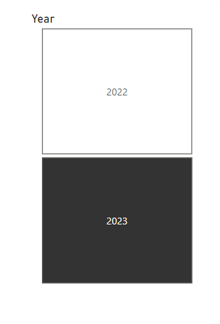
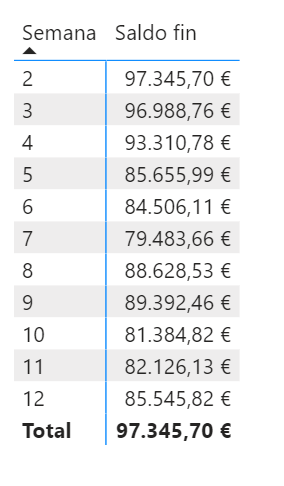
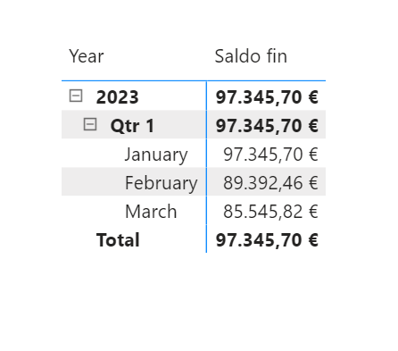



**Saldos**

Nuestro cliente necesita saber el saldo bancario a final de cada semana.  

**Preparación**

Descargar el fichero "MovimientosCuenta.xlsx" que se encuentran en Recursos.

Guardarlos en c:\Recursos_xx\  

**Desde Power BI Desktop**

0 - Abrir un nuevo fichero PBIX

1 - Cargar el fichero de excel.

2 – Cambiar el tipo de la columna Saldo a Moneda con dos decimales.

3 - Crear mediante DAX una tabla de fechas
	
4 - Crear una nueva columna que determine el número de semana (teniendo en cuenta que la semana comienza el lunes)		

5 - Crear las relaciones oportunas

6 - En la vista de informe, poner un segmentador de botones para que me permita filtrar la información por años.

7 - Mostrar un visualizador para sacar el saldo del final de la semana, creando la medida de DAX adecuada:

8 - Añadir un visualizador para mostrar el saldo bancario a final del año, del trimestre o del mes.

	 
9 - Cerrar 

10 - Guardar el fichero como "SaldosBanco.pbix"

20 de Marzo 2023        @rccorella
