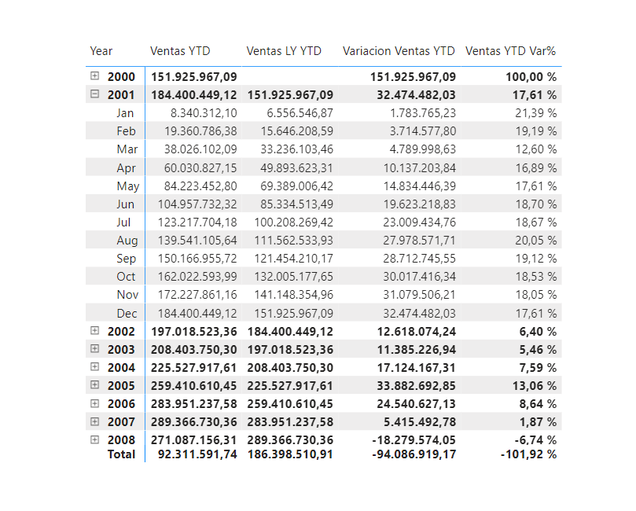



**Year Over Year**

Año a la fecha (YTD) es un período que comienza desde el comienzo del año en curso y continúa hasta la fecha actual. Desea calcular las ventas YTD y comparar esto con la cifra del mismo período del año pasado.

**Preparación**

Utilizamos como base el ejercicio 009 - 010.

Abrir el fichero que tendremos en nuestra carpeta "c:\misSoluciones_XX\Ventas Cronus.pbix"

**Desde Power BI Desktop**

Calcular las siguientes medidas:

1 - Ventas YTD: calcula las ventas YTD. Formato de esta medida como moneda.

2 – Ventas LY YTD: calcula las ventas del año pasado de YTD. Formato de esta medida como moneda.

3 - Variacion Ventas YTD: calcula la variación de ventas entre este año y las ventas de YTD del año pasado. Formato de esta medida como moneda. (Sugerencia: esta es simplemente la diferencia entre las ventas de YTD y las ventas de LY YTD)
	
4 - Ventas YTD Var%: calcula la variación de ventas entre este año y las ventas de YTD del año pasado en porcentaje. Formatear esta medida como Porcentaje.	

5 - Unidades YTD: calcula las unidades YTD: Unidades vendidas hasta la fecha.

6 - Unidades LY YTD: calcula las unidades del año pasado de YTD.

7 - Variacion unidades YTD: calcula la variación de unidades entre este año y las unidades de YTD del año pasado

8 - Unidades YTD Var%: calcula la variación de unidades entre este año y las unidades de YTD del año pasado en porcentaje. Formatear esta medida como Porcentaje.

9 - Poner todas las medidas en una Matriz en una nueva página llamada Over Year.

10 - Guardar el fichero como "Ventas Cronus.pbix"

21 de Marzo 2023        @rccorella
