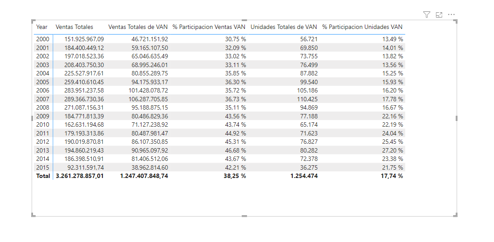



**Cuota de mercado**

Las ventas de “VanArsdel” comprenden productos fabricados por “VanArsdel” y otras compañías. Desea saber cuánto de estas ventas son productos fabricados por “VanArsdel”.

**Preparación**

Utilizamos como base el ejercicio 009 - 010.

Abrir el fichero que tendremos en nuestra carpeta "c:\misSoluciones_XX\Ventas Cronus.pbix"

**Desde Power BI Desktop**

Calcular las siguientes medidas:

1 - Ventas totales de VAN: calcula las ventas donde el fabricante de los productos es “VanArsdel”. Formato de esta medida como moneda.

	Tip: Buscar VanArsdel en la tabla de fabricantes
	

2 – Porcentaje de participación en el mercado de ventas (% Participacion Ventas VAN): calcula el porcentaje de ventas de productos fabricados por “VanArsdel” a partir del total de ventas.

3 - Unidades totales de “VanArsdel”: calcula las unidades donde el fabricante de los productos es “VanArsdel”

	
4 - Porcentaje de participación en el mercado de unidades: calcula el porcentaje de unidades de productos fabricados por “VanArsdel” a partir del total de unidades. Formato de esta medida como Porcentaje.

5 - Poner todas las medidas en una Matriz en una nueva página Mercado.

6 - Guardar el fichero como "Ventas Cronus.pbix"

21 de Marzo 2023        @rccorella
