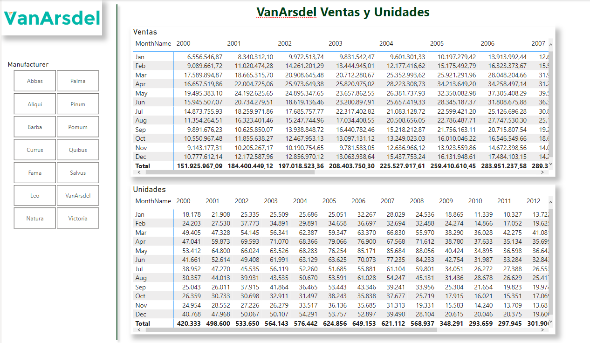



**Visualizaciones**

Mostrar visualizaciones

**Preparación**

Utilizamos como base el ejercicio 009 - 010.

Abrir el fichero que tendremos en nuestra carpeta "c:\misSoluciones_XX\Ventas Cronus.pbix"

**Desde Power BI Desktop**

Mostrar unos visualizadores para dejarlo como la imagen:

Incluye

1 - Título
	

2 – Logotipo que encontrarás en recursos

3 - Segmentador con los fabricantes

	
4 - Matriz con Ventas con meses y años

5 - Matriz con Unidades con meses y años

6 - Línea de decoración vertical

7 - Todos los visualizadores con sombreado.

8 - Guardar el fichero como "Ventas Cronus.pbix"

21 de Marzo 2023        @rccorella
