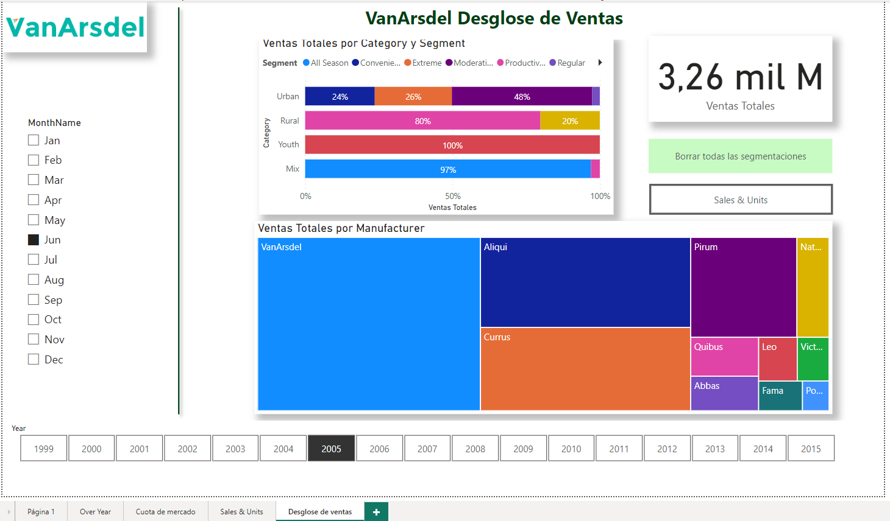



**Visualizaciones II**

Mostrar visualizaciones

**Preparación**

Utilizamos como base el ejercicio 009 - 010.

Abrir el fichero que tendremos en nuestra carpeta "c:\misSoluciones_XX\Ventas Cronus.pbix"

**Desde Power BI Desktop**

Mostrar unos visualizadores para dejarlo como la imagen:

Incluye

1 - Título: VanArsdel Desglose de Ventas
	

2 – Logotipo que encontrarás en recursos (con sombreado)

3 - Segmentador con los nombres de los meses (MonthName)

	
4 - Segmentador de mosáico con los años (Year)

5 - Tarjeta con las ventas Totales.  Esta tarjeta marcará las ventas totales de todos los años, independientemente de los filtros del resto de los visualizadores.

6 - Gráfico de barras 100% apiladas, donde pueda ver las ventas Totales por Categoría (Category) y como porcentajes el segmento (segment).

	Deberá mostrar las etiquetas de datos sin decimales.

7 - Gráfico TreeMap con las ventas por fabricante (manufacturer)

8 - Añadir un botón para borrar todas los segmentadores (sólo última versión de Power BI)

9 - Añadir un botón, que nos lleve a la página "Sales & Units"

10 - Añadir una línea vertical sombreada y de color verde.

8 - Guardar el fichero como "Ventas Cronus.pbix"

21 de Marzo 2023        @rccorella
