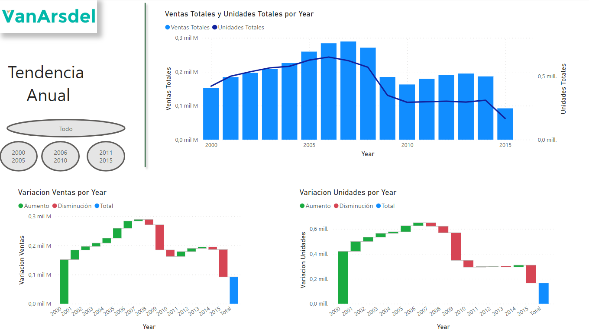



**Visualizaciones III**

Mostrar visualizaciones con marcadores

**Preparación**

Utilizamos como base el ejercicio 009 - 010.

Abrir el fichero que tendremos en nuestra carpeta "c:\misSoluciones_XX\Ventas Cronus.pbix"

**Desde Power BI Desktop**

Mostrar unos visualizadores para dejarlo como la imagen:

Incluye

1 - Título: Tendencia Anual
	

2 – Logotipo que encontrarás en recursos (con sombreado)

3 - Gráfico de columnas agrupadas y de líneas con 

	- Años (Year)
	- Ventas totales
	- Unidades Totales (en el eje de las líneas)

	
4 - Gráfico Cascada

	- Años (Year) 
	- Variación de las Ventas
	
Ojo con la ordenación por años.

5 - Gráfico Cascada

	- Años (Year)
	- Variación de unidades
	
Ojo con la ordenación por años.
	
6 - Pondremos 1 botón ovalado con el fondo en gris, con texto "Todo" que al pulsar nos muestre los gráficos con todos los años

7 - Pondremos 1 botón ovalado con el fondo en gris, con texto "2000 2005", que al pulsar nos muestre los gráficos solo con los años del 2000 al 2005

8 - Pondremos 1 botón ovalado con el fondo en gris, con texto "2006 2010", que al pulsar nos muestre los gráficos solo con los años del 2006 al 2010

9 - Pondremos 1 botón ovalado con el fondo en gris, con texto "2011 2015", que al pulsar nos muestre los gráficos solo con los años del 2011 al 2015

10 - Añadir una línea vertical sombreada y de color verde.

8 - Guardar el fichero como "Ventas Cronus.pbix"

21 de Marzo 2023        @rccorella
