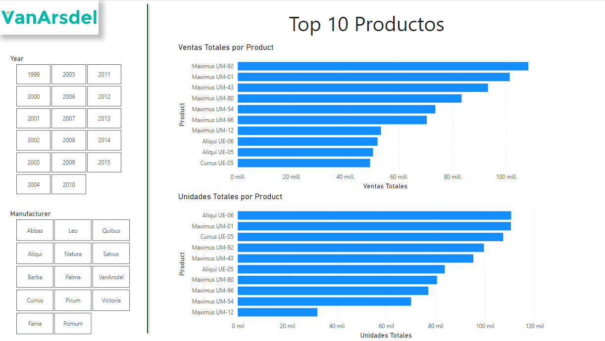



**Visualizaciones IV**

Mostrar visualizaciones con filtros TOP

**Preparación**

Utilizamos como base el ejercicio 009 - 010.

Abrir el fichero que tendremos en nuestra carpeta "c:\misSoluciones_XX\Ventas Cronus.pbix"

**Desde Power BI Desktop**

Mostrar unos visualizadores para dejarlo como la imagen:

Incluye

1 - Título: Top 10 Productos
	

2 – Logotipo que encontrarás en recursos (con sombreado)

3 - Gráfico de barras apiladas con el TOP 10 de artículos por Ventas Totales 

	- Ventas totales
	- Producto (solamente los 10 que mejor venta en importe tengan)

	
4 - Gráfico de barras apiladas con el TOP 10 de artículos por Unidades Totales 

	- Unidades totales
	- Producto (solamente los 10 que mejor venta en unidades vendidas)
	
Usar filtros TOP N

5 - Segmentador por años

6 - Segmentador por fabricante

7 - Añadir una línea vertical sombreada y de color verde.

8 - Guardar el fichero como "Ventas Cronus.pbix"

23 de Marzo 2023        @rccorella
