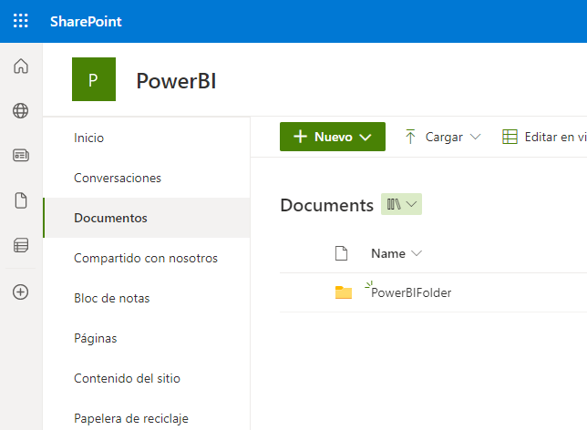
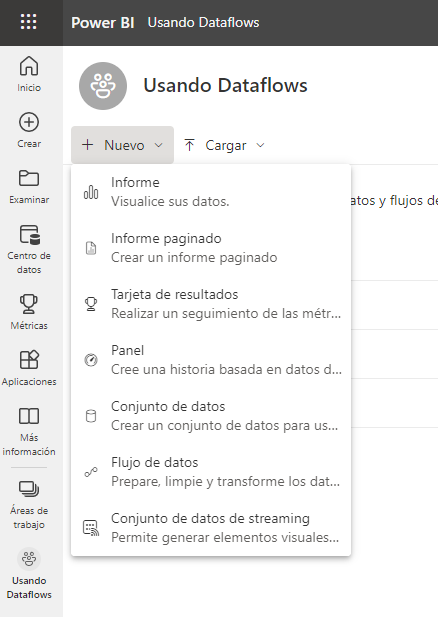
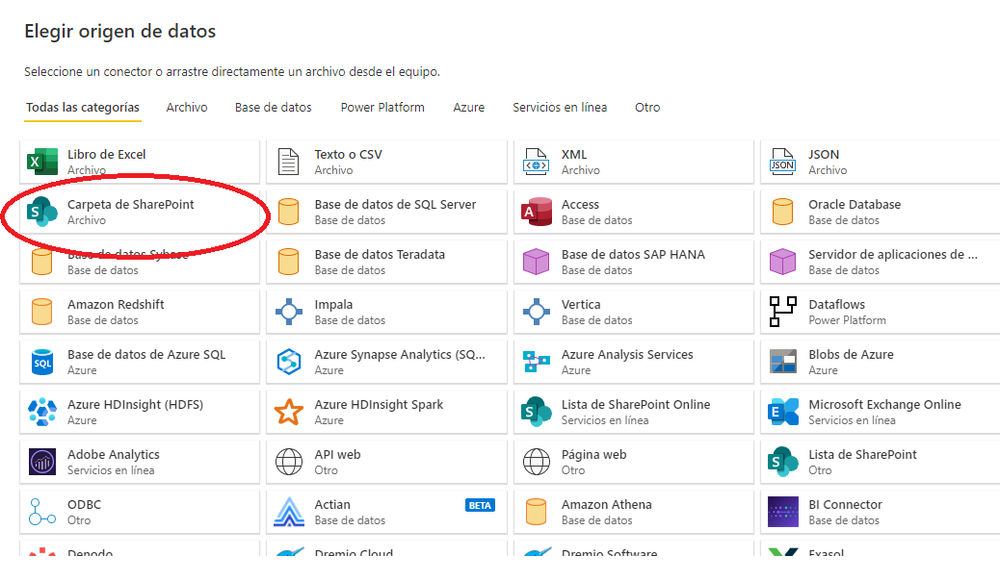
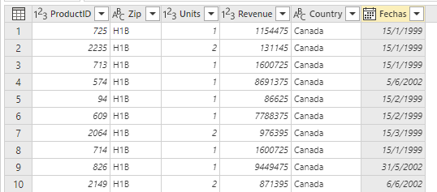
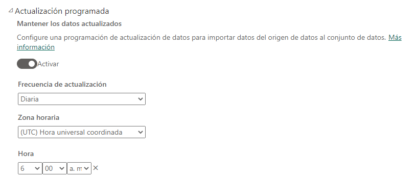



**Dataflow**

En este ejercicio, crearemos una carpeta en SharePoint, donde dejaremos diferentes ficheros CSV que importaremos mediante un Dataflow.

**Preparación**

Utilizaremos la carpeta internacional, con cuatro ficheros que disponíamos en ejercicios anteriores.

Abrir el Servicio de Power BI, con el usuario de la máquina virtual.

Crearemos un sitio en SharePoint llamado PowerBI y crearemos, dentro de documentos, una carpeta llamada PowerBIFolder:

**Desde Power BI Service**

1 - Crear un area de trabajo "Internacional"

2 - Desde ese área de trabajo, crear un dataflow importando la carpeta de SharePoint:

3 - Usamos el conector de SharePoint

4 - Importaremos los 4 ficheros en una sola tabla

5 - Convertiremos la tabla fecha en formato Fecha

	Tip.  Es posible que tengamos que usar alguna transformación para no tener que usar el cambio regional.
	
6 – Eliminar las tablas restantes y dejarlas así:

7 - Guardar el dataflow como "Ventas internacionales" 

8 - Poner una actualización a las 06:00 

	

	
9 - Finalizar el ejercicio

25 de Marzo 2023        @rccorella
