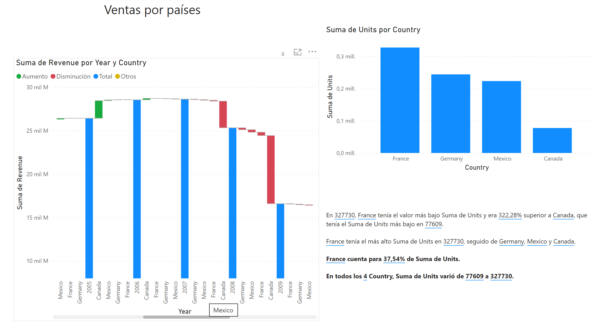
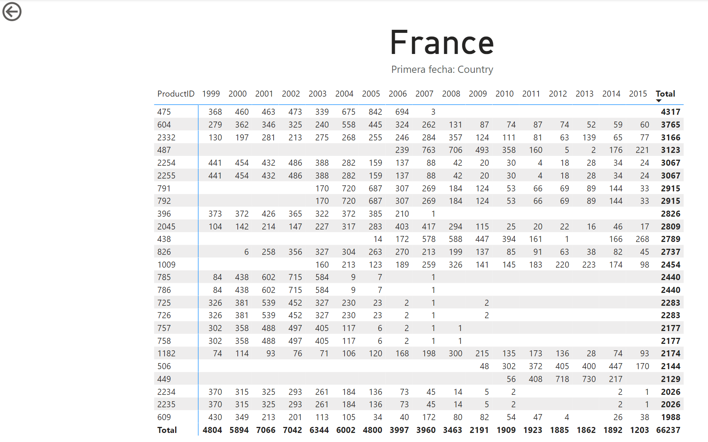



**Consumir Dataflow**

En este ejercicio, consumiremos el dataflow creado en el ejercicio 020 para crearnos un report y publicarlo en el servicio web.

**Preparación**

Debemos tener el dataflow "Ventas internacionales"

**Desde Power BI Desktop**

1 - Creamos un nuevo fichero pbix llamado "VentasFromSharepoint_XX.pbix"

2 - Obtendremos datos del dataflow "Ventas internacionales"

3 - Añadiremos un título "Ventas por países"

4 - Incluiremos, en la primera página, que llamaremos "Principal", un gráfico de cascada, donde veremos las ventas por años, y cuanto aporta cada país.

5 - Incluiremos un gráfico de columnas, con las unidades vendidas por país

6 - Añadiremos un visualizador "Narración Inteligente"
	
7 – Crearemos una página de detalle "Detalle por país" oculta.

8 - En dicha página mostraremos el detalle de los 25 mejores productos más vendidos (unidades) en el país por cada año, ordenados por número de unidades vendidas.

9 - Desde la página principal, podremos seleccionar en el gráfico de unidades por país, ver el detalle, que nos llevará a la página de "Detalle por pais"

10 - Guardar el fichero

11 - Publicar el "Mi area de trabajo"

12 - Verificar que funciona correctamente.

25 de Marzo 2023        @rccorella
