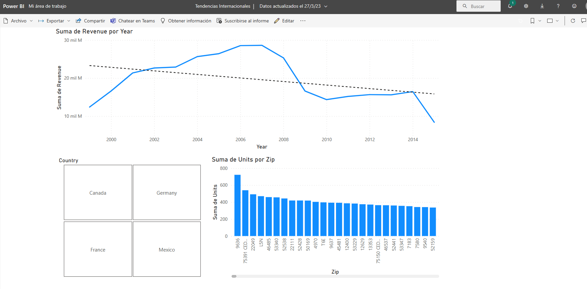



**Diseño en Power BI Service**

En este ejercicio, usaremos un dataset publicado previamente, para diseñar un report online.

**Preparación**

Debemos de tener publicado el pbix "VentasFromSharePoint_xx.pbix"

**Desde el servicio de Power BI**

1 - Crear un nuevo report, usando como origen de datos el conjunto de datos "VentasFromSharePoint_xx"

2 - Mostrar una gráfica con las ventas por años, así como una línea de tendencia.

3 - Añadiremos un segmentador de paises

4 - Incluiremos un gráfico de unidades por código postal (zip)

5 - Guardaremos el report como "Tendencias internacionales"

6 - Verificar que funciona correctamente.

25 de Marzo 2023        @rccorella
