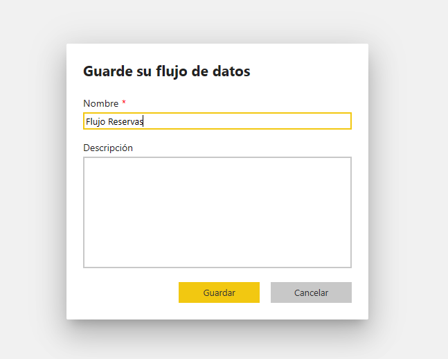
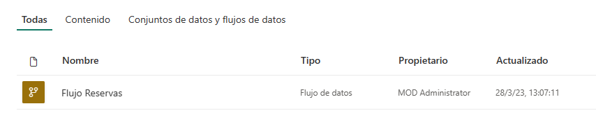
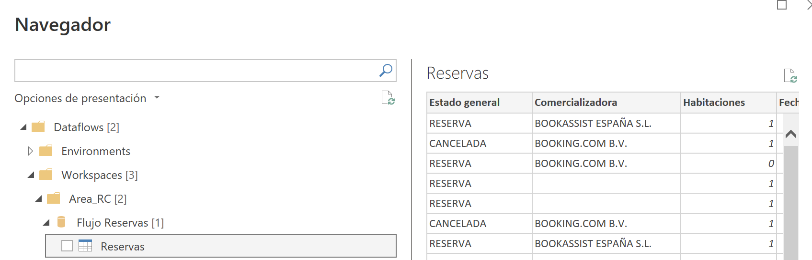
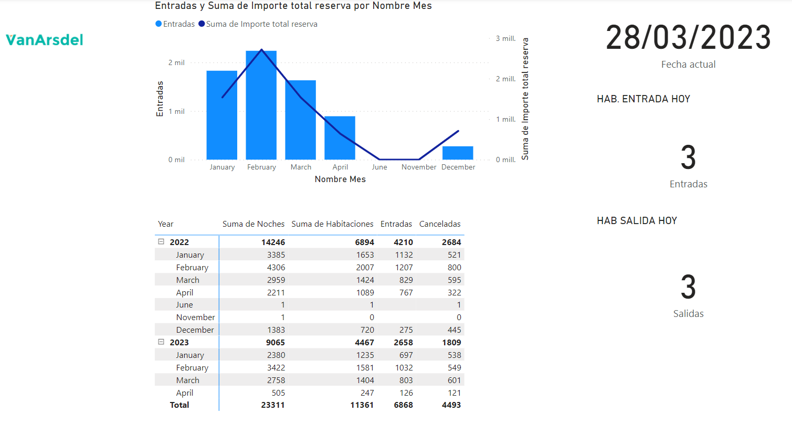



**Actualizar la fecha a hoy**

En este ejercicio, subiremos a OneDrive un fichero "reservas.xlsx" que encontrarás en la carpeta recursos.

Usaremos un dataflow para obtener los datos.

Realizaremos un fichero PBIX llamado ReservasHotel_XX.pbix que nos muestre las reservas por día

**Preparación**

Tener el entorno del servicio web de Power BI y acceso a OneDrive con el usuario de la plataforma web.  Si lo utilizamos en nuestro equipo, preferiblemente usar un navegador de incognito.

**Desde el servicio de Power BI**

1 - Subir el fichero "reservas.xlsx" a OneDrive.

2 - Crear un area de trabajo en Power BI Service "Hotel_XX", donde XX serán vuestras iniciales

3 - Desde ese area de trabajo, crearemos un DataFlow, con una tabla nueva con los datos procedentes del fichero Excel.

4 - Hacemos las siguientes transformaciones

	Quitamos la columna nº y Fecha Anulación Reserva
	Rellenamos los campos vacios de "Segmento" por "DIRECTO"

	Tip: Actualiza la tabla en este momento
	

5 - Abrir Power BI Desktop y obtenemos los datos del dataflow

6 - Crear una tabla de calendario

7 - Mostrar un visualizador con las entradas (NO CANCELADAS) por meses, así como los ingresos 

8 - Mostrar una matriz, con noches reservadas totales, el número de habitaciones totales, las habitaciones NO canceladas según fecha de entrada, las habitaciones CANCELADAS según fecha de entrada.

9 - Un visualizador con la fecha de hoy (que se actualice según el día en el que estemos)

10 - Un visualizador con las habitaciones que entran hoy (que se actualice según el día en el que estemos)

11 - Un visualizador con las habitaciones que salen hoy (que se actualice según el día en el que estemos)

12 - Publicar el report en el servicio web. 

13 - Crear un panel con las habitaciones por meses con los ingresos.

28 de Marzo 2023        @rccorella
