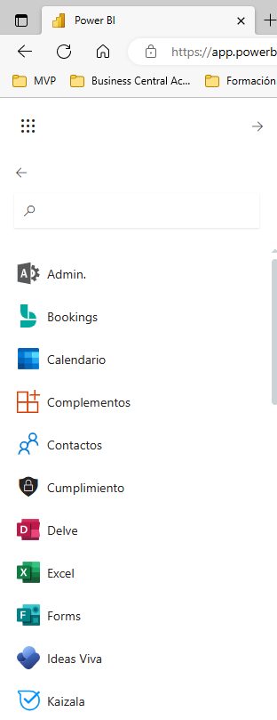

**Crear un dashboard que actualice datos en tiempo real**

En este ejercicio, utilizaremos varias herramientas de la familia Microsoft para realizar unas encuestas y que se actualicen directamente en un cuadro de mando de Power BI.

Usaremos

	- Microsoft Forms
	- Microsoft Power Automate
	- Microsoft Power BI

**Preparación**

Tener el entorno del servicio web de Power BI y acceso con el usuario de la plataforma web.  Si lo utilizamos en nuestro equipo, preferiblemente usar un navegador de incognito.

** Microsoft Forms**

1 - Desde Forms crearemos un formulario para solicitar estadísticas a nuestros usuarios que se llamará "Cuestionario Satisfacción".  En él incluiremos 4 preguntas

- Nombre
- Pregunta 1,2,3 y 4: opciones de 1 a 5

2- Desde Recopilar Respuestas, debemos de permitir que cualquiera pueda contestar y allí tenemos el link para poder publicarlo y que rellenen nuestras encuestas.

** Crear un panel en tiempo real **

3 - Vamos a crear un panel que capture los datos en tiempo real, por lo que procederemos a situarnos en nuestra area de trabajo (Area XX) y desde allí crearemos el conjunto de datos en Streaming:

4 - Dentro de las opciones seleccionaremos la API y pulsamos siguiente:

5 - Le pondremos un nombre al conjunto de datos (Encuesta_XX), así como cada uno de los valores:

6 - Marcamos la opción de Activar Análisis del historial de datos.

7 - Pulsamos Crear, para crear el conjunto de los datos.

** Crear un power automate para recoger las encuestas **

8 - Desde Power Automate, vamos a recoger las respuestas de las encuestas y poder incorporarlos a Power BI.

9 - Utilizaremos un flujo automatizado, con el desencadenador "Forms" - "Cuando se envía una respuesta nueva".

10 - El siguiente paso será obtener los detalles de la respuesta.

11 - finalmente rellenamos los datos en Power BI

12 - Guardamos el flujo como Recoge_encuestas_XX

**Probamos el proceso**

13 - Procedemos a rellenar una encuesta y a darle enviar.

14 - Desde el area de trabajo donde tenemos el conjunto de datos, vemos que tenemos la opción de crear un informe directamente:

15 - Crearemos un informe (en el servicio web) en el que vayamos visualizando los datos

16 - Crearemos un informe en Power BI desktop para comprobar que podemos obtener el dataset:

29 de Marzo 2023        @rccorella
