

**Enviar un mail periódicamente con una consulta de Power BI**

El responsable de recepción de nuestro hotel, necesita recibir la información diaria de cuantas entradas y salidas, tiene hoy y mañana, para poder tener disponible personal suficiente en recepción y evitar que se acumulen huéspedes esperando.

Usaremos

	- Microsoft Power Automate
	- Microsoft Power BI

**Preparación**

Tener el entorno del servicio web de Power BI y acceso con el usuario de la plataforma web.  Si lo utilizamos en nuestro equipo, preferiblemente usar un navegador de incognito.

Necesitaremos el ejercicio 020 reservas.pbix

**Power BI Desktop**

1 - En el ejercicio 020, preparamos unas medidas, que nos indicaban las entradas y las salidas de hoy.

Vamos a añadir dos medidas nuevas: Entradas de mañana y salidas de mañana.  Las cuatro medidas, las incluiremos en una tarjeta múltiple:

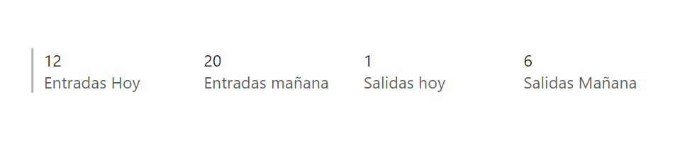

2 - Guardamos y publicamos nuestro Power BI en el area de trabajo "Area_XX"

3 - Obtendremos la consulta que realiza Power BI.  Para ello, usaremos el Analizador de rendimiento

	- 1 Pinchar en Analizador de rendimiento
	- 2 Iniciar grabación
	- 3 Actualizar Objetos visuales y localizar la tarjeta 
	- 4 copiar la consulta
	
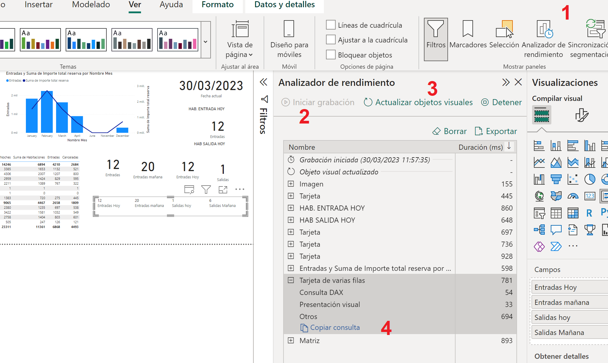

Será algo similar a esto:

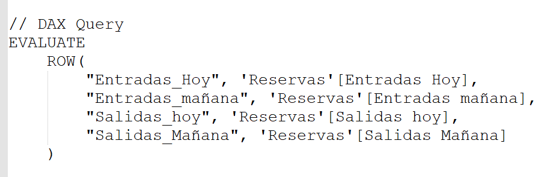

Lo guardamos en un notepad para usarlo después en el punto 8

**Power Automate**

4 - Vamos a crear un flujo periódico que envíe diariamente las entradas y salidas, consultando el Servicio de Power BI

5 - Crearemos un flujo programado, seleccionando "Crear" y "Flujo de la nube programado"

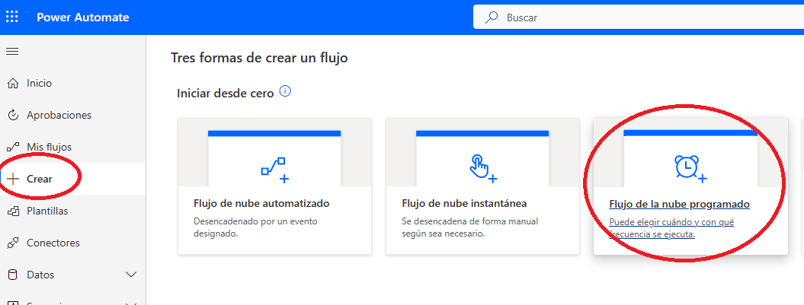

6 - En el asistente le pondremos:

	- Como nombre del flujo: Reservas XX
	- Inicio hoy a las 7:00 AM
	- Repetir cada 1 día
	
	Pulsamos crear.

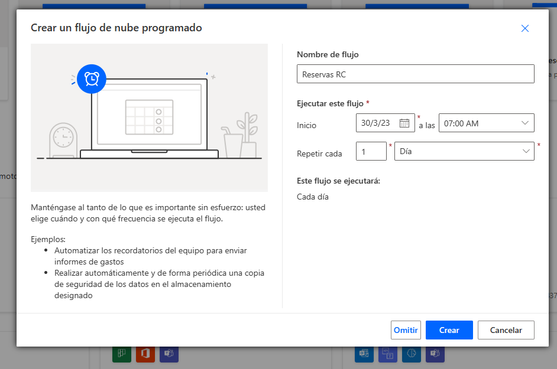

7 - Agregamos un nuevo paso, localizando el conector Power BI

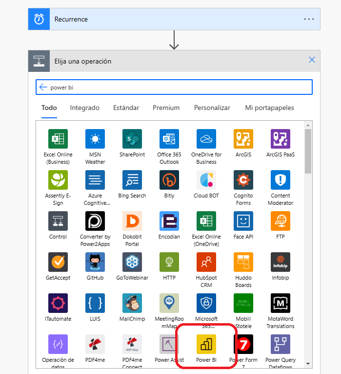

8 - Elegimos la acción "Ejecutar una consulta con un conjunto de datos" con los siguientes parámetros:

	- Area de trabajo -> Area XX
	- Conjunto de datos -> Reservas
	- Texto de la consulta, será el texto obtenido en el punto 3.
	
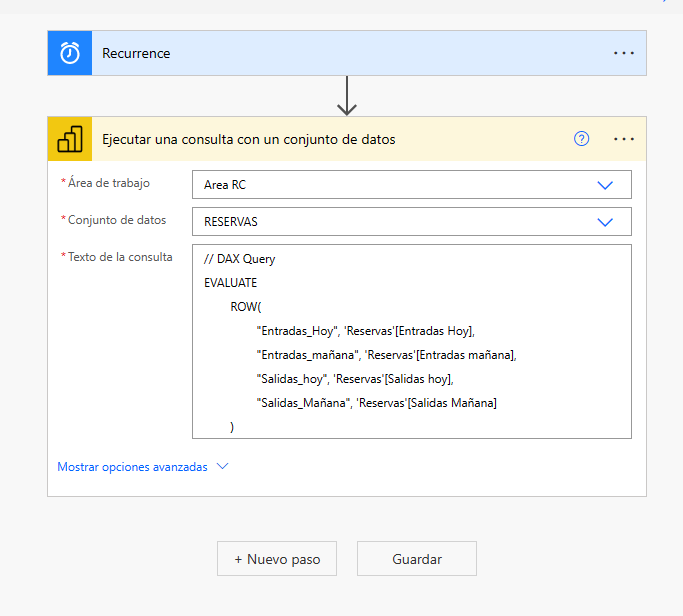

9 - Añadimos un nuevo paso y buscamos un conector "Operación de datos" para crear una tabla HTML 

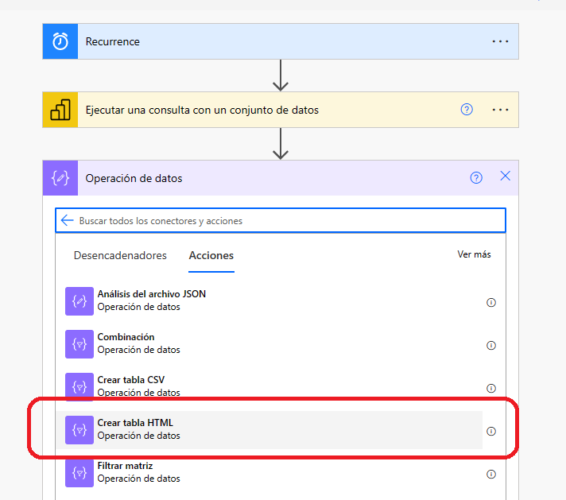

10 - En el campo "Desde" introducimos el contenido dinámico del paso de Power BI "Primeras filas de la tabla"

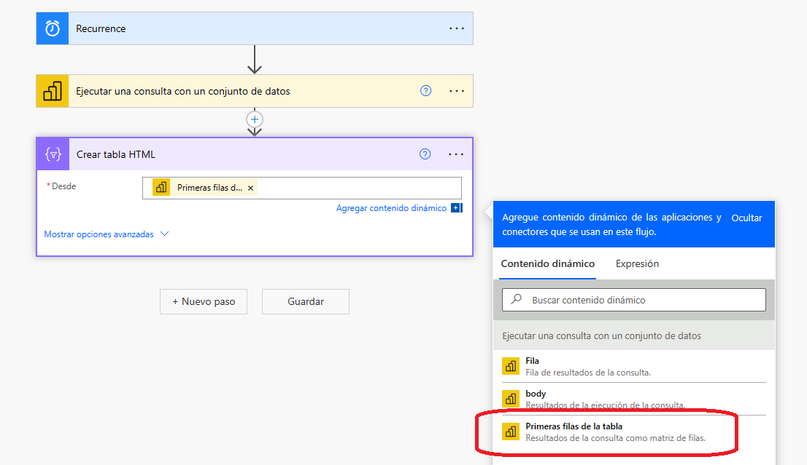

11 - Añadimos un nuevo paso, con Office 365 Outlook y seleccionamos la acción "Enviar correo electrónico V2":

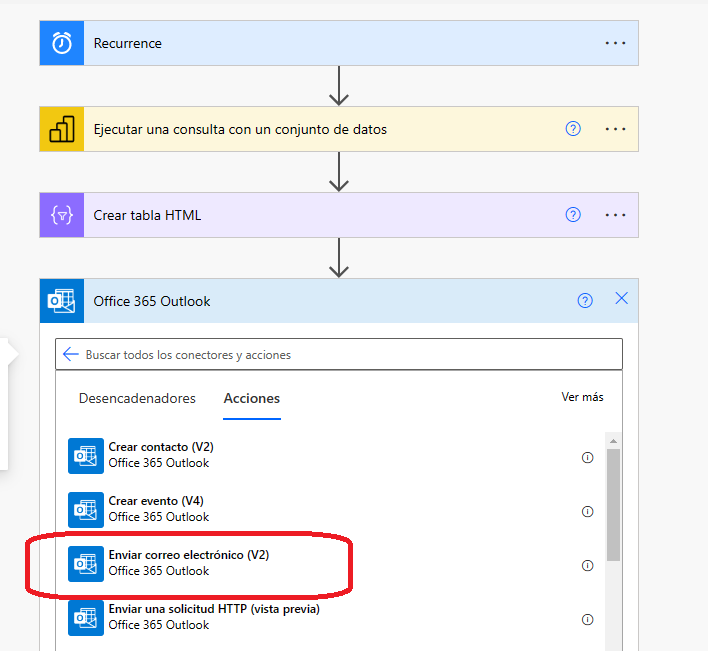

12 - En los parametros del email, pondremos

	- A: la dirección o direcciones a las que enviaremos el mensaje
	- Asunto: El asunto del mensaje
	- El Cuerpo: pondremos el texto del mensaje y como contenido dinámico la salida del paso anterior.

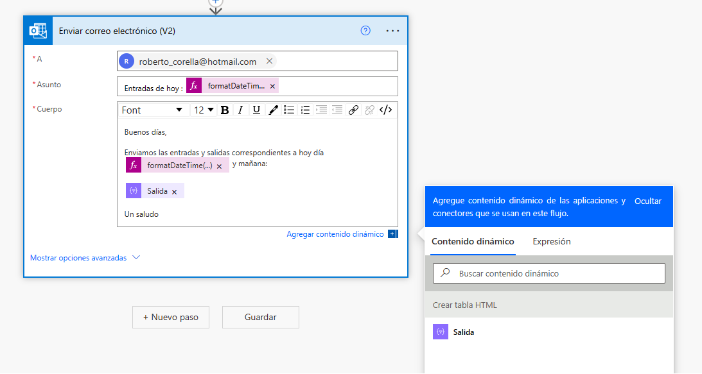

Si queremos añadir la fecha de hoy, podemos usar la expresión:  formatDateTime(utcNow(),'dd-MM-yyyy')

13 - Pulsamos guardar

**Probamos el proceso**

14 - Una vez terminado el flujo, podemos proceder a probarlo, pinchando sobre "Probar" en el menú superior, seleccionando la opción "Manualmente"

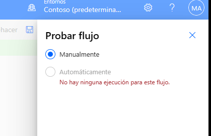

15 - Pulsamos "Ejecutar flujo" y "Listo"

16 - Comprobamos que se ha ejecutado correctamente:

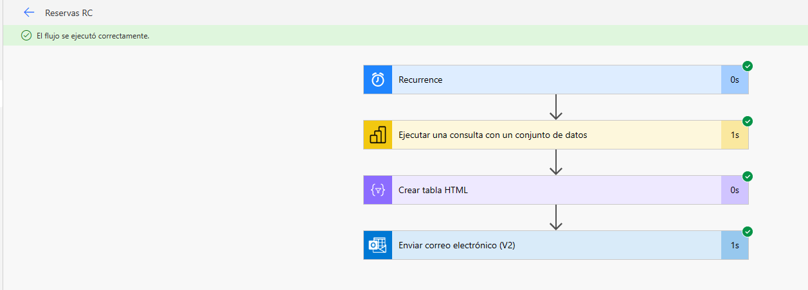

17 - Verificamos que se ha recibido el email:

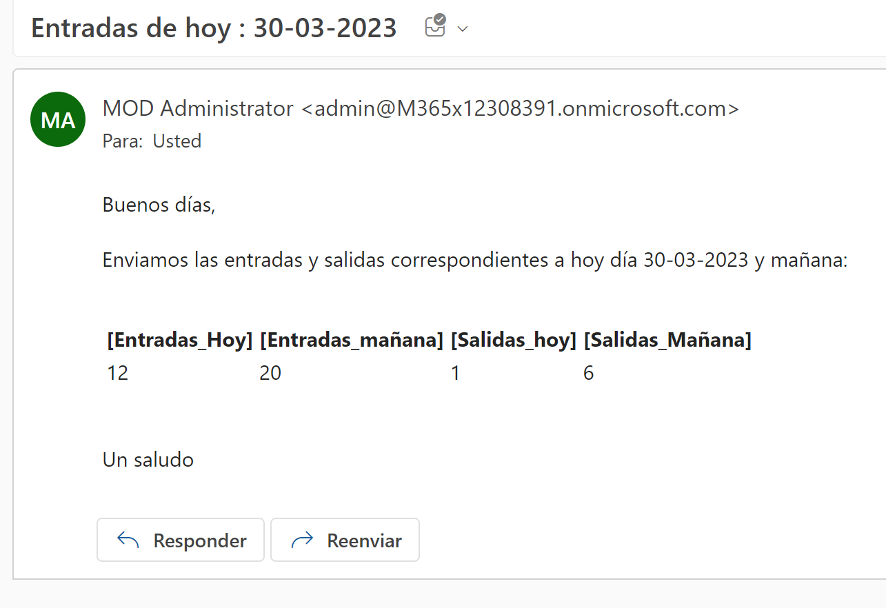

18 - Guardar el flujo y ya estará disponible para que se ejecute cada día.

30 de Marzo 2023        @rccorella
