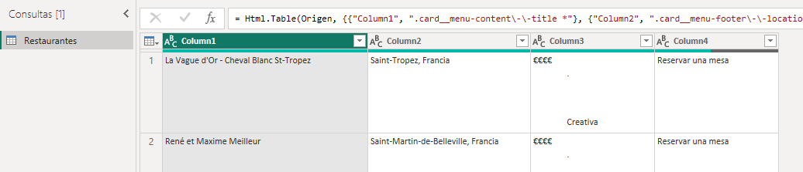
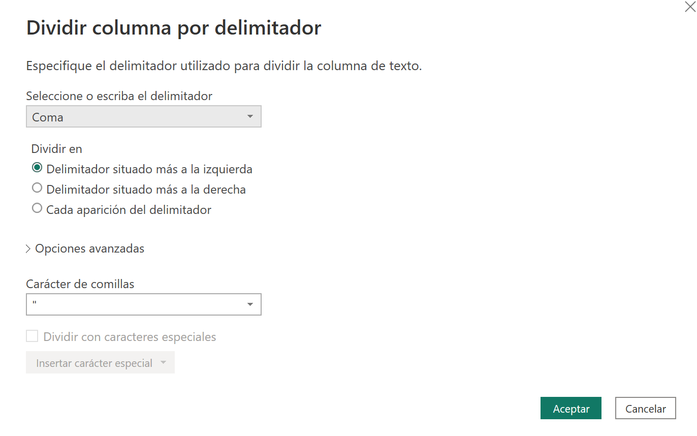
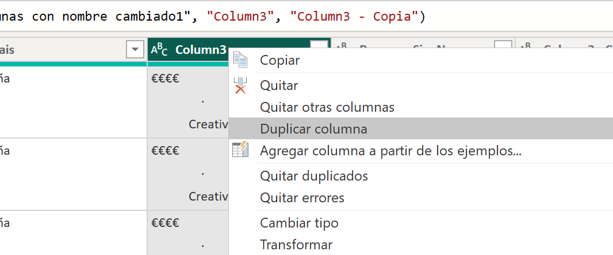
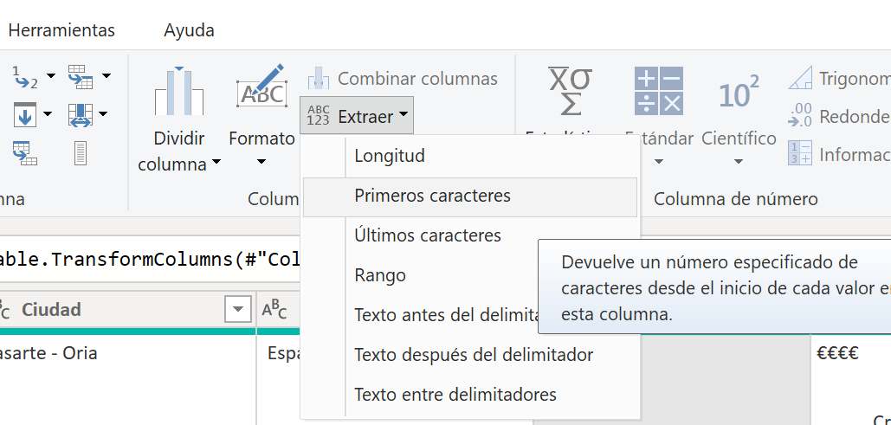
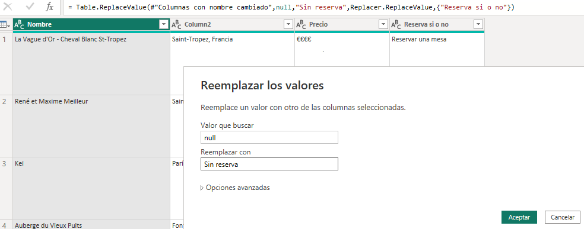
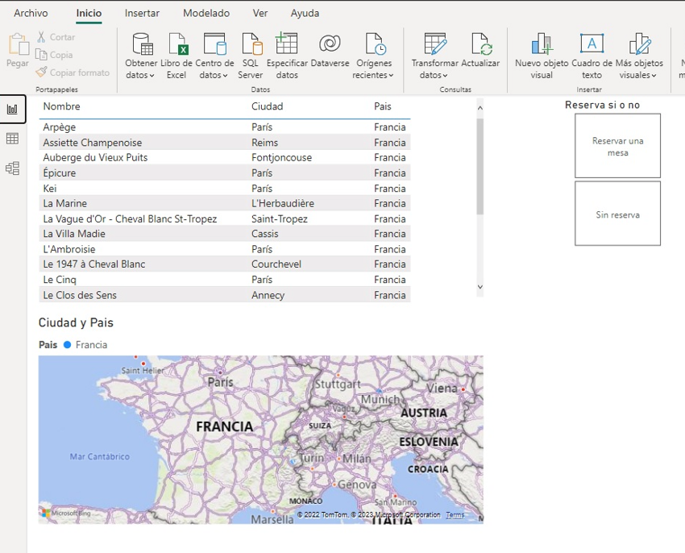

**Ejercicio Obtener datos de una web**

**Datos Web**

Ejemplo de como obtener datos de una web para generar un report en Power BI.

Web de muestra:

<https://guide.michelin.com/es/es/restaurantes/3-estrellas-michelin>

Seleccionar como Origen de datos: Web

Nos solicita confirmación de los datos.

En la previsualización podemos ver el contenido de la tabla:

Seleccionamos **Transformar** para acceder al Power Query Editor

**Transformar datos**

Una vez en el Power Query Editor

1 - Cambiar el nombre a la tabla: Restaurantes

2 - Dividir la columna ciudad,pais en dos columnas.  Para ello usaremos la instrucción de transformación **Dividir columna**

3 - Duplicar la columna del precio y tipo de comida (columna3).  Para ello seleccionamos la columna y con el botón derecho, seleccionamos **"Duplicar columna"**

4 - En la primera columna creada, extraemos los 4 primeros caracteres, mediante la instrucción **Extraer** y la opción **"Primeros caracteres"**

Le indicamos el número de caracteres a extraer:

5 - Usamos la misma función, para extraer los últimos caracteres, pero con la opción **"Últimos caracteres"**

6 - Usamos la función **Recortar** para eliminar los espacios que tengamos delante.

7 - En la última columna observamos que tenemos "Reservar una mesa" o null.  Sustituimos el valor "null" por "Sin reserva"

8 - Renombramos los nombres de las columnas Nombre, Ciudad, País, Precio, Tipo de comida, Reservas si o no

9 - Guardamos y aplicamos los cambios

10 - Insertar una tabla con Nombre, ciudad y país

11 - Insertar un mapa coropletico, añadiendo ciudad (Ubicación) y pais (leyenda)

12 - Añadimos un segmentador de "Reserva sí o no"

13 - Modificamos la propiedad del segmentador a "Mosáico"

14 - Añadir una imagen al report, como logotipo

15 - Guardar

